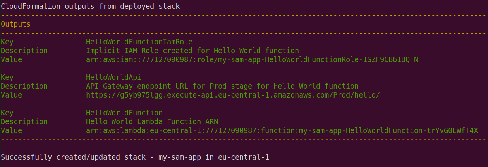
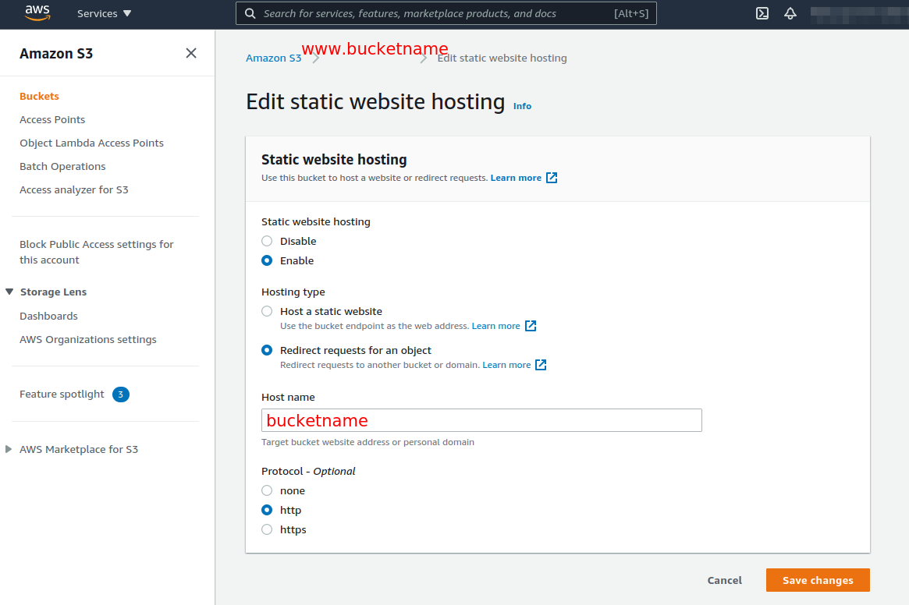
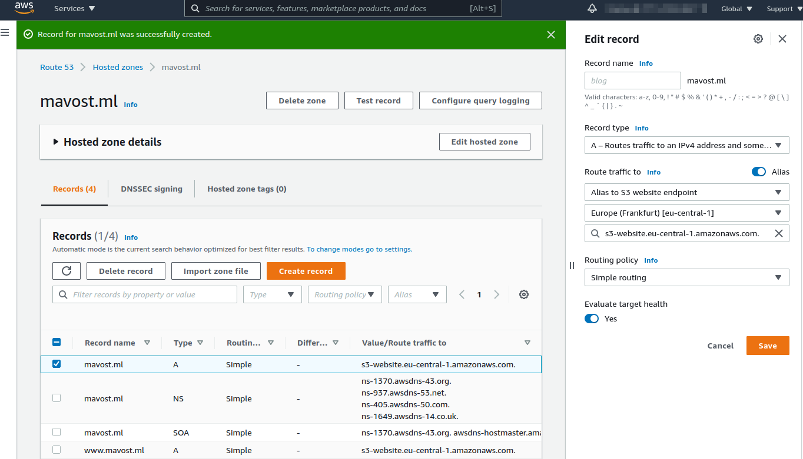
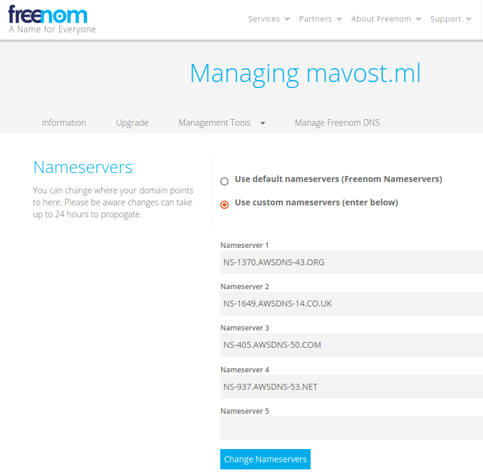
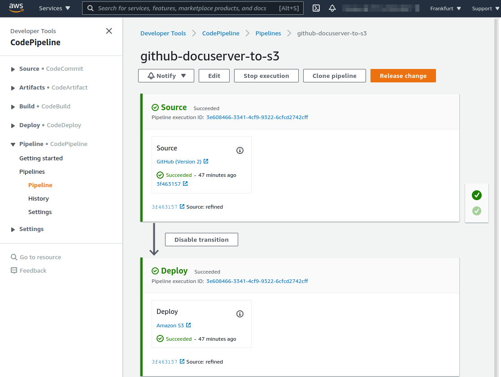

<!-- markdownlint-disable MD033 -->
# Working with Amazon Web Services (AWS)

## Adding AWS-CLI to Ubuntu (v. 20.04)

### Installation

- `curl -sS "https://awscli.amazonaws.com/awscli-exe-linux-x86_64-2.0.30.zip" -o "awscliv2.zip"`  
  update above path by looking up [latest-version](https://github.com/aws/aws-cli/blob/v2/CHANGELOG.rst)
- unzip content and install `unzip awscliv2.zip && sudo ./aws/install`
- verify installation and cleanup `aws --version && rm -rf aws && rm awscliv2.zip`

### Linking the CLI to your AWS account

- check "programmatic access" in IAM user detail
- add new user
- add permissions - policies(left) - "AdministratorAccess"
- open User summary &rightarrow; "Security credentials" &downarrow; "Access keys" &rightarrow; "Create access key" download CSV or copy/paste key to a safe place

  ``` {bash}
  Example:
  AKIA3RN7------RVROB5
  gzpYwF9M-------------GhsODuvpXaa1JtRuhVY
  ```

- add a profile to the CLI by running `aws configure --profile awscliuser`  
  &rightarrow; type in keys  
  &rightarrow; type in default region "eu-central-1"  
  &rightarrow; type in default output "json"

- credential files (config, credentials) are located in `$HOME\.aws`
- testing access to an existing resource in your AWS account, e.g. by `aws s3 ls --profile awscliuser` replies

  ``` {bash}
  2021-08-05 11:58:32 inventory-12345
  2021-09-01 15:04:55 example.com
  2021-09-01 18:47:09 www.example.com
  ```

- by adding the parameter `export AWS_PROFILE=awscliuser` in either .profile or .bashrc you can omit the "--profile awscliuser"
identification when submitting commands interactively

### Adding bash shell syntax completion

Edit *.bashrc* file by adding the following line and executing the file:  
`[ -x /usr/local/bin/aws_completer ] && complete -C '/usr/local/bin/aws_completer' aws`  
which triggers given that the **aws_completer** command is present

### (optional) Installing AWS serverless application model (SAM) CLI

[source](https://docs.aws.amazon.com/serverless-application-model/latest/developerguide/serverless-sam-cli-install-linux.html)

- `curl -sSLO "https://github.com/aws/aws-sam-cli/releases/download/v1.27.0/aws-sam-cli-linux-x86_64.zip"`  
  Note: had problems with the master version post(1.27) not deploying the bootstrap system
- unzip content and install `unzip aws-sam-cli-linux-x86_64.zip -d sam-cli && sudo sam-cli/install`
- verify installation and cleanup `/usr/local/bin/sam --version && rm -rf sam-cli && rm aws-sam-cli-linux-x86_64.zip`  
  Note: `/usr/local/bin` should actually be included in `PATH` variable already

#### Working with AWS SAM CLI

1. `sam init` initializes a serverless application with an AWS SAM template in the [language of choice](https://docs.aws.amazon.com/serverless-application-model/latest/developerguide/sam-cli-command-reference-sam-init.html)
2. to build your serverless application, use the `sam build` [command](https://docs.aws.amazon.com/serverless-application-model/latest/developerguide/serverless-sam-cli-using-build.html)
3. deploy your application using the `sam deploy --guided --debug` [command](https://docs.aws.amazon.com/serverless-application-model/latest/developerguide/serverless-deploying.html)  
  
4. Testing serverless Lambda function  
  `curl https://----API-----.execute-api.eu-central-1.amazonaws.com/Prod/hello/ -w "\n"`  
  with `----API-----` referring to the endpoint-URL generated in the previous step replies in JSON format:  
  `{"message":"hello world"}`

---

## Hosting a static website on AWS S3 buckets

Sequence:

1. setting up *S3 bucket* with *bucketname* (e.g. *mavost.ml*), access permissions and inserting content
    - unblock **all public access** by deselecting check box and confirming decision
    - add access policy with customized *bucketname*

      ``` json
      {
        "Version": "2012-10-17",
        "Statement": [
          {
            "Sid": "PublicReadGetObject",
            "Effect": "Allow",
            "Principal": "*",
            "Action": [
              "s3:GetObject"
            ],
            "Resource": [
              "arn:aws:s3:::bucketname/*"
            ]
          }
        ]
      }
      ```

    - initial upload of files, e.g. from your own repository (Add Files / Folders)
    - added a second bucket called `www.bucketname` and repeated above first two steps but instead
    of uploading the same hosted content again I added a redirect  
    

2. setting up *Route 53* by adding a hosted zone
    - add new hosted zone (not included in AWS free tier!) for both bucket destinations  
      domain *bucketname* &rightarrow; s3-website.eu-central-1.amazonaws.com S3 bucket  
      subdomain `www.bucketname` &rightarrow; s3-website.eu-central-1.amazonaws.com S3 bucket
    - screenshot  
      
    - copy AWS Route 53 DNS server names for use in step 3

3. add server names in Freenom Domain administration
    - screenshot  
      

4. setting up AWS CodePipeline (one pipeline covered by FreeTier)
    - screenshot  
      

---

### Advanced web hosting of the S3 content using Cloudfront, Route 53 and a Freenom domain

- Fine-tuning: In the Cloudfront distribution, for the origin-URL, instead of using the S3 bucket endpoint, use the S3 static website url which is slightly different. Distributions then are all working with subdirectory "/" endpoints going directly to the *index.html* files within the subdirectory.

- Note: the Cloudfront cache does only update once a day so your hosted site will refresh much slower than what you expect, [source](https://aws.amazon.com/premiumsupport/knowledge-center/cloudfront-serving-outdated-content-s3/)  
&rightarrow; use the s3 website endpoint to verify the result  
&rightarrow; add versioning or flush the cache (*expect added costs*)

<!-- markdownlint-enable MD033 -->
---

## AWS Certified Solutions Architect - Associate Course Preparation

### Identity and access management

#### AWS IAM

- Provide access and identity management for all regions of an account
- Connect entities (groups, users, roles) with permissions on resources (policies)
- Users can and should inherit permissions from groups
- The *Principle of Least Privilege* states to only provide a user with the minimum amount of permissions necessary to do their job in the cloud
- Roles are temporary means for a user/machine/resource to switch to another set of permissions **even on different accounts**

##### Best Practices

- When provisioning resources with a use case in mind which involves interaction with other services one should assign roles directly to the acting resource. In this way one does not have to involve user generation.

1. Create a role with required secondary service policies
2. Configure machine by assigning the role and downloading PEM credential key
3. Copy IP address of launched instance
4. Login to machine via ssh or direct connection in management console

    ```bash
    cd Downloads
    # close access to other users
    chmod 400 MACHINECREDENTIAL.pem
    # enter machine and accept its ED25519 key fingerprint
    ssh ec2-user@MACHINEIP -i MACHINECREDENTIAL.pem
    # update machine
    sudo su
    yum update -y
    # leave super user mode
    exit
    ```

5. Given that machine IAM role includes S3 admin access:

    ```bash
    # list buckets in account
    aws s3 ls
    # create bucket
    aws s3 mb training_dummy_1020202020
    # create file
    echo "hello, this is my dummy file" > hello.txt
    # upload file
    aws s3 cp hello.txt s3://training_dummy_1020202020
    # list files in bucket
    aws s3 ls s3://training_dummy_1020202020
    ```

- Instead of the above, one could configure the aws CLI by running `aws configure` with a user's access key and secret access key, given the user carries the required permissions/policies, effectively hard-coding your security into the machine &rightarrow; not recommended
- Roles in contrast can be altered and reassigned without disturbing a running instance to which they are attached.

---

### Storage

#### S3

Data in object store is cached/replicated by AWS to reach 11 x 9's Durability and mostly 99.99% availability.

The entire bucket namespace is stretching across all AWS accounts, i.e. it is global and bucket names must be unique. However, the region chosen for a bucket is still fixed on a particular location.  
Object URLs map to https://#bucket#.s3.amazonaws.com/#prefix#/#key#.  
Successful object uploads result in a HTTP 200 code.

##### Storage classes

- S3 Standard: access time 100-300ms; handles 5500 requests/s per prefix/folder; >=3AZ
- S2 Standard IA: is not the most cost-effective storage medium for infrequent access; >=3AZ
- S3 One Zone-IA: this is the most cost-effective storage medium when IA suffices and an increased chance of data loss is acceptable; =1AZ
- S3 Intelligent Tiering: watches access behavior to uploaded content and re-arranges it to cost effective storage types; >=3AZ
- S3 Glacier Instant Retrieval: long-term archiving with instant retrieval. Storage is generally cheaper than with S3 Standard but retrieval will cost extra; >=3AZ
- S3 Glacier Flexible Retrieval: long-term archiving with recovery time between minutes to 12h. Storage is generally cheaper than with S3 Standard but retrieval will cost extra; >=3AZ
- S3 Glacier Deep Archive: This is the cheapest storage option; Retrieval takes 12 to 48h; >=3AZ

##### Optional Components

Security:

- Buckets are private unless they are explicitly opened to the public (unblock public access). So this is the first step to clear, e.g. for S3 web hosting purposes.
- Setting bucket policies can steer the accessibility of a bucket in its entirety

  ```JSON
  {
      "Version": "2012-10-17",
      "Statement": [
          {
              "Sid": "PublicGetObject",
              "Effect": "Allow",
              "Principal": "*",
              "Action": "s3:GetObject",
              "Resource": "arn:aws:s3:::#BUCKET#/*"
          }
      ]
  }
  ```

- In contrast enabling Object ACLs can provide fine-grained permission down to object level as one can permit public access to every folder/file
- Both options can be combined

Static Website hosting:

Open bucket to public access using unblocking/policies and specify `index.html` and `error.html`.

Versioning:

After versioning is enabled it cannot be removed/cleared, only suspended. Versioning keeps track of all writes, including deletes. MFA is supported by versioning, e.g. to make it harder to delete objects.  
Older versions of an object become inaccessible at first but can be made accessible through ACLs. Once an object is deleted, an empty delete marker is put up as the current version. Deleting the delete marker will restore the latest version of an object before its deletion.

Lifecycle Management:

Manages cost-effectiveness of your operation on the data storage side. Becomes particularly important when using versioning in order to archive/phase out older data becoming irrelevant (or moving rarely used objects to the infrequent access category). Scope can be filtered by prefix/folder/attribute. *Note*: works only in direction of storage tiers of apparent lower cost (e.g., S3 Standard to Glacier), not in opposite direction.

Encryption:

- In transit: SSL/TLS; HTTPS
- Server-side encryption at rest: SSE-S3 &rightarrow; AES 256-bit; SSE-KMS keys (leading to bottle neck in case of many requests per second); SSE-C &rightarrow; Customer provided key
- Client-side encryption at rest: encryption before upload/decryption after download

Server-Side Encryption can be enforced through bucket policy, i.e. a PUT request will have to include a SSE-encryption header in order to be processed by S3.

Data Protection:

- Object lock is used to store data in a WORM model: Governance (few can alter)/Compliance mode (none can alter)
- Define a specific retention period (e.g., 30 days) which prevents changes to an object during that interval
- Legal Hold prevents alterations to the versioning of an object, e.g. for providing regulatory audit trails (user needs s3:PutObjectLegalHold permission)
- Glacier Vault Lock: a way of applying a WORM model to Glacier

S3 Replication:

Renamed from S3 Cross-Region replication as it now can be used between buckets in the same region.
Automatically duplicates bucket content to another bucket.
Versioning needs to be enabled in both buckets and only new objects are replicated after enabling the function. You'll need a CRON/sync task to grab the older data. Delete markers are not replicated by default.

Performance Enhancement:

- Multipart uploads can provide speed ups and recommended for files > 100MB and are mandatory for files larger than 5GB
- For downloads of objects one can used Byte-Range Fetches in a similar manner
- Latency can be reduced by spreading the objects in a bucket over several folders/prefixes.

#### AWS Instance Store Volumes

Ephemeral (short-term) block storage which can host an AMI image tied to the overlying EC2 hardware. AMI is sourced from S3, not a snapshot.
Data persists while the machine is not stopped/terminated or hardware does not fail.  
Not recommended for production, no encryption.

#### Elastic Block Store (EBS)

- General Purpose SSD (gp2/3): for storage of any EC2 OSs - uses cases demanding high number of IOPS (reads/writes up to 16000IOPS) instead of throughput
- Provisioned SSD (io1/2): for use cases demanding even higher IO (DBs/transactional) up to 64000IOPS
- Throughput optimized HDD (st1): for throughput-heavy use cases, e.g. ETLs / Big Data (500MB/s)
- Cold-HDD (sc1): for file servers ((250MB/s)) - cheapest block storage

##### Volume Characteristics

- Are tied to the AZ of the running instance
- Can be resized on the fly
- Can switch volume types on the fly

##### Snapshots

- It's a point in time copy of an EBS Volume saved to S3.
- Are locked to the originating region and need to be copied to a destination region if to be used elsewhere (Snapshot Management Console: snap, copy snap, create image from snap in destination region).
- First snapshot is baseline and takes longer, subsequent snaps are incremental, only.
- Instances should be stopped to capture all data of a machine.

##### Encryption

- AES-based or KMS encryption are possible.
- Latency is hardly affected.
- Copying an unencrypted snap allows encryption on the fly (using KMS). Volume based on snap will be encrypted before copy and remains encrypted.
- Encrypted volumes remain encrypted in snapshot form.
- Root devices can be encrypted.

##### Effects of EC2 Hibernation on EBS

- Hibernation saves a RAM image to the EBS disk additional to whatever data existed on the volume.
- Main benefit is faster boot time over a cold start of a machine.
- On Demand / Reserved Instances, only
- RAM size limit is 150GB
- C,M,R family instances have the feature
- Supported by AWS Linux, Ubuntu, Windows OS
- Hibernation active up to 60 days

#### Elastic File System (EFS)

- EFS is a network file system using NFSv4 protocol. Windows EC2s not supported, currently.
- Encryption using KMS possible.
- It can be mounted on many EC2 instances in multiple AZs simultaneously.
- High throughput (10GB/s), availability (1000s connections) and scalability (PiB) at high cost.
- Use cases: CMS, Web Server Content.
- Two performance levels: general purpose / IO optimized
- Two storage tiers: Standard/ Infrequently Accessed
- Only pay for the storage used, no pre-provisioning required
- Automatic backups / Lifecycle management possible

#### FSx for Windows / Lustre

FSx for Windows: A managed Windows Server running a SMB-based file service. Use cases are distributed Windows-based applications or services: AD, Sharepoint, ACLs, DFS.  

FSx for Lustre: serving data for high performance applications, GB/s throughput, millions of IOPS, sub-millisecond latencies, e.g. for Machine learning, AI, HPC, modelling; can store data on S3

#### AWS Backup

Flexible service to backup not only other services (EC2, EBS, EFS, both Amazon FSx, AWS Storage Gateway)
but also whole AWS accounts, given they were set up using the AWS Organizations service.  
Benefits: Centralization, automation option, compliance/audit friendly.

---

### Server-based Compute

#### AWS EC2 - Elastic Compute Cloud

##### Pricing Tiers

- "On Demand" for flexible use, PoCs, unknown long term use
- "Reserved", renting machines for minimum 1 year (or optional 3 years) at a discount up to 72%, for constantly required workloads, e.g. dynamic web servers
- "Reserved Flex": as above with option to switch to similar/higher machine type at up to 50% savings rate, scaling up/across is possible
- "Spot": unused capacity at fluctuating, but massively reduced prices (up to 90%) for non-time critical workloads
- "Dedicated": running workloads on a physically isolated hardware/rack to fulfil legal, regulatory, licensing requirements at increased cost over all the other tiers where accounts might share the same physical hardware, isolated by virtualization software. Can be booked "On Demand"/"Reserved".

##### AMIs

- Linux2 AMI: billed in seconds
- Windows: billed in minutes

##### Compute Families / Sizes

##### Placement Groups

Placement groups organize instances of similar purpose an can boost performance, durability/resilience of an architecture.

- Only certain type offer to be put in a placement group
- You can move/reorganize them from the CLI/SDK, only, and they need to be stopped restarted
- You can't merge them
- AWS recommends homogeneous instances in a PG
- A Cluster PG can't span multiple AZs, while the others can.

1. Cluster PG: performance, low latency, high network throughput
2. Spread PG: instances are placed on distinct underlying hardware; used for individual critical instances
3. Partition PG: individual racks (network/power source) for each partition

##### Networking Interfaces

- ENI (Elastic Network Interface): all purpose, low throughput, used to separate networking according to purposes.
- EN (Enhanced Networking): for speeds between 10 - 100 Gbps. Always prefer the newer ENA (Elastic Network Adapter) over the Intel 82599 VF (Virtual Function) option. SR-IOV (single root IO virtualization) puts less stress on instance CPU.
- EFA (Elastic Fabric Adapter): High performance computing and ML use cases; offers further speedup by OS-bypass technology

ENI < EN-VF < ENA < EFA

##### Communication with Instances

- Linux, SSH, port 22
- Windows, RDP, port 3389
- Browser, HTTP, port 80
- Browser-encrypted, HTTPS, port 443

##### Security groups

Security groups are virtual firewalls for resources in your VPC, e.g., EC2 instances.

- Basically, all inbound communication is blocked by default. To let "everything" in on a certain port/protocol allow IPv4 0.0.0.0/0 and IPv6 ::/0 address ranges.
- All outbound traffic is allowed by default.
- Changes to security groups take effect immediately.
- You can have several EC2 instance within the same SG.
- You can have several SGs attached to an EC2 instance.

The following are the basic characteristics of security groups for your VPC:

- SCs act at the instance level, not the subnet level.
- There are quotas on the number of security groups that you can create per VPC, the number of rules that you can add to each security group, and the number of security groups that you can associate with a network interface. For more information, see Amazon VPC quotas.
- You can specify allow rules, but not deny rules.
- You can specify separate rules for inbound and outbound traffic.
When you create a security group, it has no inbound rules. Therefore, no inbound traffic originating from another host to your instance is allowed until you add inbound rules to the security group.
By default, a security group includes an outbound rule that allows all outbound traffic. You can remove the rule and add outbound rules that allow specific outbound traffic only. If your security group has no outbound rules, no outbound traffic originating from your instance is allowed.
- Security groups are stateful. If you send a request from your instance, the response traffic for that request is allowed to flow in regardless of inbound security group rules. Responses to allowed inbound traffic are allowed to flow out, regardless of outbound rules.  

Reference: [Security Groups](https://docs.aws.amazon.com/vpc/latest/userguide/VPC_SecurityGroups.html)

##### Bootstrap script

It runs during the first launch of an instance at root user permission.  
Example:

```bash
#!/bin/bash
yum update -y
# install web server
yum install httpd -y
# start web server
yum service httpd start
# provide content
echo "<html><body><h1>Hello World!</h1></body></html>" > /var/www/html/index.html
```

##### Meta Data

Can be queried from within an EC2 instance, e.g., during a bootstrap script:

```bash
echo "<html><body><h1>Hello World! My IP is " > /var/www/html/index.html
curl http://169.254.169.254/latest/meta-data/public-ipv4 >> /var/www/html/index.html
echo "</h1></body></html>" >> /var/www/html/index.html
```

User data within an EC2 instance can be queried using `http://169.254.169.254/latest/user-data` and provides the bootstrap script.

#### vCenter for running VMWare on AWS

VMware is a widely established technology and used by organizations around the world for private cloud deployments. Some organizations opt for a hybrid cloud strategy and would
like to leverage AWS services. Others want to use VMware as a starting point for their cloud migration.

The Service runs on dedicated hardware hosted in AWS using a single AWS account.
Each host has two sockets with 18 cores per socket, 512 GiB RAM, and 15.2 TB Raw SSD storage. Each host is capable of running multiple VMware instances (up to the hundreds).
Clusters can start with two hosts up to a maximum of 16 hosts per cluster.

#### AWS Outposts

AWS Outposts rack is a fully managed service that extends AWS infrastructure, services, APIs, and tools to a customer's premises. Fully managed infrastructure which comes in two flavors:

1. Outposts rack: You can purchase a variety of AWS Outposts rack configurations featuring a combination of Amazon Elastic Compute Cloud (EC2) instance types, Amazon Elastic Block Store (EBS) gp2 volume, and Amazon Simple Storage Service (S3) on Outposts. AWS Outposts rack is delivered as an industry-standard 42U rack and scale up to 96 racks.

2. Outposts server: Outposts servers provide local compute and networking services that are ideal for low-latency, local data processing needs for on-premises locations such as retail stores, branch offices, healthcare provider locations, or factory floors. Individual servers in 1U or 2U form factor

---

### Databases

#### AWS RDS

Workhorse for OLTP and supports SQL Server, MySQL, MariaDB, PostgreSQL, Oracle on top of Aurora

Multi-AZ: handles replication of primary DB to standby DBs for increased availability; mandatorily included in Aurora instances; an RDS will automatically failover to the secondary instance on primary failing. Can not be used for performance increase. Only one DNS entry.

Read-Replica: Read-only copy of primary R/W DB for increased scalability; can be cross-AZ and also cross-region, not directly intended for disaster recovery. Both instances have their own DNS entry one can point to. You can use this configuration for disaster recovery with adjustments. Requires RDS option "Automatic Backups" enabled to work. up to five read replicas per instance.

#### AWS Aurora

RDBMS developed by AWS which is compatible to MySQL and PostgreSQL and significantly faster than both. Scales in 10GB increments up to 128TB.
Features:

- Strong data replication: 2 * 3 AZ copies will be generated.
- Self-healing capabilities as inconsistencies are actively sought and corrected
- Read/write performance only impacted after losing 3/2 copies, i.e. replicas.
- Replicas can be Aurora(15)/MySQL(5)/PostgreSQL(5) flavor
- Automated backups enabled at default price
- offers a serverless flavor for spiky/unpredictable loads

#### Aurora Serverless

Aurora Serverless automatically starts up, shuts down, and scales capacity up or down based on your application's needs, and you pay only for capacity consumed.

#### DB Failover

Failover is automatically handled by Amazon RDS so that you can resume database operations as quickly as possible without administrative intervention. When failing over, Amazon RDS simply flips the canonical name record (CNAME) for your DB instance to point at the standby, which is in turn promoted to become the new primary. We encourage you to follow best practices and implement database connection retry at the application layer.
Failover recovery, as defined by the interval between the detection of the failure on the primary and the resumption of transactions on the standby, typically completes within *one to two minutes*. Failover time can also be affected by whether large uncommitted transactions must be recovered; the use of adequately large instance types is recommended with Multi-AZ for best results. AWS also recommends the use of Provisioned IOPS with Multi-AZ instances for fast, predictable, and consistent throughput performance.

Reference: [AWS RDS](https://aws.amazon.com/rds/faqs/)

#### AWS DynamoDB

DynamoDB is a fully managed NoSQL database service that provides fast and predictable performance and scalability. Stored on SSD. Single-digit millisecond latency.

Features:

- automatic replication across three AZs
- needs a gateway to be accessed from a VPC
- defaults to eventually consistent reads (wait 1s) and optionally offers strongly consistent reads at higher latency but better reliability
- offers caching service DynamoDB Accelerator (DAX) which can be put between Application and DynamoDB to even further speed things up
- pay per request which is generally more expensive than provisioned capacity
- offers encryption using KMS
- integrates with CloudWatch/CloudTrail/DirectConnect(DX)/IAM policies and roles/VPC endpoints/VPN connections
- offers *DynamoDB transactions* to force ACID compliance on a table (atomicity, consistency, isolation, durability) in a "all or nothing" way
- offers *DynamoDB Backup* to save/restore data without performance impact in a particular Region
- offers "Point-in-Time Recovery* to protect against accidental writes/deletes, i.e. rolling back the DB to a previous state (between 5min to last 35d)
- offers *Streams* as a time-ordered sequence of item-level changes in a table for the last 24 hours
- offers *Global tables*, i.e., multi-master/multi-Region replication, as part of the DynamoDB streams functionality (at latency <1s)

#### Amazon DocumentDB

Offers a service to run MongoDB workloads without having to worry about maintenance.

Use case:
On-Prem MongoDB server &rightarrow; AWS DB Migration Service &rightarrow; DocumentDB

#### Amazon Keyspaces

Offers a service to run Cassandra NoSQL DB without having to worry about maintenance and saving cost as it is serverless.

#### Amazon Neptune

Amazon's Graph DB service. Used for entity resolution, knowledge graphs, fraud detection.

#### Amazon Quantum Ledger Database (QLDB) for Ledger DBs

Blockchain, financial, logistics, supply-chain transactional ops.  Immutable, transparent, crypto,  blah, blah...

#### Amazon Timestream for Time-Series Data

This would be the best and most cost-effective solution for storing time-series data.

Use cases:

- IoT: agriculture
- Analytics:
- DevOps:

---

### Networking

#### VPC

Cooking recipe:

1. Manually creating a VPC results in the following objects being generated, automatically:

    - Default Security Group
    - Network Access Control List (NACL)
    - Main Route Table  

2. Adding representations of public/private subnets: CIDR Address ranges for VPC/subnets can go from 0.0.0.0/16 to 0.0.0.0/28 and IP address range for each subnet is reduced by 5 addresses reserved by AWS. Subnets can not span multiple AZs.
3. Enabling auto-assignment of public IPs in public subnets
4. Create internet gateway and attach it to the VPC - only one IG per VPC.
5. **Best practice**: Create individual route table for public subnets. Create route from IG to the internet: `0.0.0.0/0`. Associate public subnets. (in this way any new subnets will only inherit settings from the main route table which are more restrictive usually)
6. Deploy instances, a web server (public subnet) and a DB server (private subnet). :-)
7. Add a SG for **public internet** inbound web traffic (HTTP/S, SSH) and associate it with the web server. Add another SG for inbound DB connectivity (ICMP/ping, HTTP(DbAdmin), SSH and MYSQL) from all **public subnets** in the VPC.
8. Ping/SSH into the other machine from the web server and note that the DB server is disconnected from the internet.

##### NAT Gateway

Used to enable instances to communicate with the internet. It is placed as an quasi-instance in a public subnet, effectively providing redundant internet access, there. No SGs involved. No need to patch.

1. Create NAT gateway, assign elastic IP address.
2. Edit main route table by adding any subnet IP ranges pointing to the NAT gateway.

##### Network ACL (NACL)

First line of defense against intruders in form of a firewall between route tables and subnets:

- The default NACL coming with a VPC allows all traffic
- Newly created NACLs block all traffic
- Each subnet only can have association with on NACL
- NACL can associate with many subnets
- NACLs are stateless
- NACLs have separate inbound/outbound rules
- NACL firewall rules are executed in an ordered list from lowest to highest number

For a new network ACL for internet-facing purposes:

1. allow required inbound traffic rules
2. allow required outbound traffic rules
3. add ephemeral port ranges to outbound traffic rules, e.g. for NAT. (ports 1024-65535)

##### VPC Endpoints

A VPC endpoint enables you to privately connect your VPC to supported AWS services and VPC endpoint services powered by PrivateLink without requiring an internet gateway, NAT device, VP
connection, or AWS Direct Connect connection. Communication goes through AWS private backbone and does not go into the internet.

Example would be an EC2 instance reading/writing to an S3 bucket, where you would want to safe bandwidth over using a NAT gateway.

Interface Endpoints: elastic network interface with a private IP

Gateway Endpoints: virtual device you provision (S3 / DynamoDB)

##### VPC Peering

Allows you to connect 1 VPC with another via a direct network route using private IP addresses. Instances behave as if they were on the same private network.

You can peer VPCs with other AWS accounts as well as with other VPCs in the same account.

Transitive peering is not supported, only direct communication between links possible, not via middlemen.

Note: Can't have overlapping CIDR ranges.

##### VPC Private Link

The best way to expose a service VPC to tens, hundreds, or thousands of customer VPCs (!). Doesn't require VPC peering; no route tables, NAT gateways, internet gateways, etc. Requires a Network Load Balancer on the service VPC and an Elastic Network Interface (ENI) on the customer VPC.

##### AWS Direct Link

Using AWS Direct Connect, you can establish private connectivity between AWS and your data center or office.

Dedicated Connection: AWS provisions a physical connection with a single customer.
Hosted Connection: Partner provisions connection

Basically, a fibre is run from customer's premises to the closest AWS Direct Connect Location and wired to a Dedicated/Hosted router which goes to the AWS backbone.

##### Transit Gateway

Reduces complexity in highly connected VPC networks as it allows you to have transitive peering between thousands of VPCs and
on-premises data centers. Works on a hub—and—spoke model. Works on a regional basis, but you can have it across multiple regions.
You can use it across multiple AWS accounts using RAM (Resource Access Manager).

- You can use route tables to limit how VPCs talk to one another.
- Works with Direct Connect as well as VPN connections.
- Supports IP multicast (not supported by any other AWS service).

##### AWS VPN CloudHub

If you have multiple sites, each with its own VPN connection, you can use AWS VPN CloudHub to connect those sites together.

- Hub-and-spoke model like the VPC peering connection.
- Low cost and easy to manage.
- It operates over the public internet, but all traffic between the customer gateway and the AWS VPN CloudHub is encrypted.

Uses Virtual Private Gateways.

##### AWS Wavelength

AWS Wavelength embeds AWS compute and storage services within
56 networks, providing mobile edge computing infrastructure for developing, deploying, and scaling ultra-low-latency applications.

Use case: You work for a mobile telecommunications company that is looking to partner with a popular electric car company. The partnership will allow people to design applications for their vehicles that will use a 5G network connectivity to store vehicle location information, temperature status, and other diagnostic data on the AWS Cloud; however, it will cache the information at an edge location provided by the cellular company first, so as to maximize efficiency. Which AWS service could you use to create this? AWS Wavelength embeds AWS compute and storage services within 5G networks and would be the best service to use in this scenario, i.e., ultra-low latency using 5G to AWS resources.

---

### Routing and Load Balancing

#### Route 53

Provides several functions:

1. Domain Registration / takes up to three days

2. Hosted Zones: as containers for records, and records contain information about how you want to route traffic for a specific domain. *Public hosted zones* contain records that specify how you want to route traffic on the internet. *Private hosted zones* contain records that specify how you want to route traffic in an Amazon VPC.  
The following record types exist:

    - SOA: Start of authority
    - NS: Nameserver record
    - Alias records, i.e., CNAMES and AWS Aliases, whereas one should always choose the latter when an exam question is provided
    - A records to map domains to IP addresses

3. Routing policies (A/AAAA records) to direct traffic to resources:

    - Simple Routing: just one record evenly splitting traffic between multiple IP addresses, no health checks
    - Multivalue Answer Routing: simple routing with health checks
    - Weighted Routing: splitting traffic based on specific weights, can use health checks as conditional
    - Failover Routing: active/passive, i.e., primary/secondary configuration of, e.g., two ELB targets - simulate by blocking SG ingress of health check
    - Geolocation Routing: route traffic based on its point of origin; filters on continent/country
    - Latency Routing: create a latency resource record set which keeps track of the resource latencies for the required traffic regions. This allows to map traffic to the resource performing best for each request.
    - Geoproximity Routing: Hybrid routing which can be based on location, latency, and availability to route traffic; its GUI-driven (define a traffic flow/policy, a workflow of rules) and uses spatial regions and biases to manipulate the extent of these regions

4. Health checks on resources, including SNS notification.

#### AWS Elastic Load Balancers

Elastic Load Balancing automatically distributes incoming application traffic across multiple targets, such as Amazon
EC2 instances. This can be done across multiple AZs.

Three types are available:

- Application LB: OSI Layer 7 - for general purpose http/https traffic, application aware, can use path-patters for routing decisions - content of the request can be used to route very intelligently; sticky sessions on TG level.
- Network LB: OSI Layer 4 - for high performance use (TCP/UDP, TLS, all possible ports), no intelligence.
- Classic LB: OSI Layer 7 - legacy; http/https; sticky sessions on instance level(:= routing a client user to the same application target consistently - needs to be disabled in case of server alterations); X-Forwarded-For (tracks origin of client via keeping IP in this header; aws infrastructure would only see LB's IP, otherwise); in case of down machines, LB responds with 504 timeout.
- Gateway LB: OSI Layer 3 - security-related functions.

Features:

- all LB can use health checks to verify whether a resource is available to be receiving traffic, otherwise it re-routes the traffic. If all TG are unhealthy it will send requests to all instances.
- Listeners listen on ports for particular comm. protocols connection requests
- Rules set out a set of actions which the Listener can perform. One default rule exists for each listener.
- Target Groups bundle the resources (e.g., EC2 instances) and route traffic to a particular instance, serving as the target for a rule.
- HTTPS: To use an HTTPS listener, you must deploy at least one SSL/TLS server certificate on
your load balancer. The load balancer uses a server certificate to terminate the frontend
connection and then decrypt requests from clients before sending them to the targets. Decryption happens on the LB!
- ALB/NLB can handle encryption/decryption; (TLS requires to provide one SSL certificate to LB).
- Deregistration Delay / Connection Draining is an option to keep connections open for a certain period for instances which have become unhealthy in order to gracefully wrap up any open business.
- LB IPs are dynamic unless requested to be static.

---

### Monitoring

#### CloudWatch

Monitoring service, observability platform, used to identify potential issues.

Provides:

- System-level metrics (Default), to give more detailed information on functionality out-sourced to AWS, e.g., RDS
- Application-level metrics (Custom) - needs a CloudWatch agent on the machine to be monitored. Memory utilization on an EC2 instance is an example for a custom metric.
- Alarms to notify you of a problem, there is no default alarm.

Create a billing alarm in CloudWatch for the specified amount.
This would be the most cost-effective and efficient way of alerting someone when their AWS bill reaches a certain threshold.

##### CloudWatch Logs

Monitoring service for logs (monitor, store, access/analyze):

- On-Prem
- CloudTrail
- Lambda
- EC2
- RDS

Log Event: timestamp/data  
Log Stream: collection of events from the same source, e.g. one instance.  
Log Group: Collection of streams relating to one piece of infrastructure, e.g. Apache web servers.

After installing the Cloudwatch Agent to a machine one can select various log files to be monitored by pointing to the file paths on the machine, .e.g., `/var/log/http/access_log`, and start the agent with the config file.

Notes:

- EC2 instance needs permission to write to CW logs.
- Mere storage (no processing) of logs can also be done in S3.
- Real-time monitoring should be done with Kinesis.

Analysis:

1. Create filter patterns, i.e. regex patterns for errors

2. Use CloudWatch Logs Insights: queries in an SQL-style manner

3. Set up alarms

#### Amazon Managed Service for Prometheus / Grafana

**Grafana**: Fully managed AWS service allowing secure data visualizations for instantly querying, correlating, and visualizing your operational metrics, logs, and traces from different sources.

*Workspaces* correspond to servers, on which users can create dashboards.

Integrates with: CloudWatch, Prometheus, OpenSearch, Timestream

Use cases: container monitoring, IoT data monitoring, troubleshooting

**Prometheus**: Serverless, Prometheus-compatible service used for securely monitoring container metrics at scale.

Both services can be coupled with VPC endpoints for secure VPC access.

#### Amazon OpenSearch Service

OpenSearch is an open source, distributed search and analytics suite derived from Elasticsearch.
Amazon OpenSearch Service offers the latest versions of OpenSearch, support for 19 versions of Elasticsearch, as well as visualization capabilities powered by OpenSearch Dashboards and Kibana.

---

### Scaling compute power

**Vertically**: means more CPU power/RAM/storage provisioned for an instance.

**Horizontally**: means more instances brought online.

Clear description of the three W's (What (LT), Where (AS), When(CW)) will set out the scaling strategy.

#### Launch Templates / Launch Configurations

The cooking recipe for consistently spinning up EC2 instances.

**Launch Template**: defined by instance family/size, AMI, user configuration for boot strapping, security groups, IAM, and potentially networking information. *Note:* specifying a VPC/subnet will prevent a LT to be used for autoscaling. Can be versioned.

**Launch Configuration**: deprecated, immutable predecessor of LTs, which only works for autoscaling. Should never be chosen over a launch template.

#### Autoscaling Groups

An Auto Scaling group contains a collection of EC2 instances that are treated as a collective group for purposes of scaling and management. This scaling is only applicable to the EC2 service.

An autoscaling template ties together the launch template/configuration, networking & instance pricing scheme, interaction with load balancers (targeting, health checks), scaling policies and notifications (SNS).

Scaling capacity:

- Minimum capacity: floor, i.e., recommended setting is 2 for providing high availability but 0 is possible, which would terminate running instances.
- Maximum capacity: ceiling, i.e., your budget is the limit, so careful with setting too much.
- Desired capacity: right now required and set within the two bounds above.

Scaling policies:

- Reactive Scaling: based on observables on actual load changes you react by scaling in or out
- Scheduled Scaling: for predictive workloads
- Predictive scaling: ML-based blend of Reactive and Scheduled Scaling based on historic data.
- Steady-State Scaling: only one copy should be online at once &rightarrow; all three capacity settings equal to one.

Best practices:

- A grace period against wild scaling behavior can be set up by selecting proper warm-up / cool down thresholds. Launching instances can take minutes, terminating them is usually much quicker.
- Scale out aggressively.
- Scale in conservatively.
- Consider provisioning duration.
- For cost saving measures use a baseline of reserved instances and potentially spot market instances for the handling of load spikes.
- Use Cloudwatch metrics to get the best idea of your system load.
- Prefer predictive over reactive.
- "Bake" (highly customize and pre-install) AMI's for shorter provisioning time.
- Spread autoscaling over multiple AZs.
- Utilize ELBs' health checks to have instances terminated and re-provisioned on entering poor health states.

---

Use a predictive scaling policy on the Auto Scaling Group to meet opening and closing spikes.

Using data collected from your actual EC2 usage and further informed by billions of data points drawn from our own observations, we use well-trained Machine Learning models to predict your expected traffic (and EC2 usage) including daily and weekly patterns. The model needs at least one day’s of historical data to start making predictions; it is re-evaluated every 24 hours to create a forecast for the next 48 hours.

What we can gather from the question is that the spikes at the beginning and end of day can potentially affect performance. Sure, we can use dynamic scaling, but remember, scaling up takes a little bit of time. We have the information to be proactive, use predictive scaling, and be ready for these spikes at opening and closing. If scale by schedule was an option here, it would be a GREAT option. On your AWS exam, you won't always be given the option of the most correct solution.

#### Scaling Databases

##### Scaling RDS / Relational DBs

1. Scale vertically by using more powerful machines
2. Scale by adding storage - it can only be increased, not decreased.
3. Scale by adding Read-replicas, in-region or cross-region (read replicas get separate endpoints)
4. Consider a Aurora Serverless where scaling is outsourced to AWS with billing per second. ACUs (Aurora Capacity Units) are used to scale the serverless machine.
5. Consider refactoring the DB and move to NoSQL/Dynamo DB (!)

##### Scaling Non-Relational DBs

Dynamo DB does not have many scaling options:

- General mode is "provisioned fixed read/write IOPS" assuming a fairly predictable workload / target utilization.
- For more sporadic workloads one can shift to a "on-demand" model which scales also at
peak demand times but cost will be billed by request instead of using flat cost tiers.
- You can switch between both modes every 24h.
- Consider designing a very balanced partition key to spread your data evenly.

---

### Decoupled workflows and Messaging

#### Decoupling Architectures

Key takeaways:

- Always prefer loosely-coupled architectures over tightly-coupled architectures, i.e., prefer redundancy over reliance on single points of failure.
- Tools to achieve loose coupling are:
  - for each layer, put an ELB in charge of presiding over the distribution of traffic - not asynchronously, though.
  - use SQS being a fully managed message queuing service that enables you to decouple and
scale microservices, distributed systems, and serverless applications.
  - use SNS being a fully managed messaging service for both application-to-application (A2A) and
application-to-person (A2P) communication.
  - use API Gateway being a fully managed service that makes it easy for developers to create, publish, maintain, monitor, and secure APIs at any scale.

#### Simple Queue Service (SQS)

Simple Queue Service is a messaging queue that permits asynchronous processing of work, i.e.,
one resource will send a message to an queue, and then at some convenient time another instance/service can poll that message from the queue for processing.

Features:

- Delivery delay can be set to range from 0 to 15 minutes.
- Message size can go up to 256kB of text in any format.
- Encryption in transit by default and optionally at rest, too.
- SQS message retention ranges from 1 minute to 14 days; def. is 4 days.
- Polling options for long and short polling available; def. is short but should be changed to long (because the former burns money), by adding a connection time window.
- Queue depth when used as a metric in CloudWatch can tell you that you need more workers in your autoscaling group. Set alarms accordingly.
- Visibility timeout: is a lock that is placed on a message in the queue after being picked up by a worker. If the worker fails to clear the lock and message after 30 seconds default the message reappears in the queue. Potentially leads to duplication if process time is long and needs tuning.
- Can be coupled with SNS for storing undelivered notifications.

Standard: Does not guarantee FIFO order and message duplication. Nearly unlimited transactions per second
SQS-FIFO: FIFO (First-In-First-Out) queues are designed to enhance messaging between applications when the order of operations and events is critical or where duplicates can't be tolerated. 300 messages per second at extra cost.
SQS dead-letter queue (DLQ): An SQS dead-letter queue is a standard queue where other SQS queues (source queues) can send messages that can't be processed (consumed) successfully - after a given number of retries. It's great for debugging as it allows you to isolate issues so you can debug why their processing doesn't succeed.

#### Simple Notification Service (SNS)

Push-based messaging sends messages on specific topics out to a list of subscribers, or fan out to multiple groups of subscribers.

Possible subscribers:

- Services: Kinesis Data Firehose, SQS, Lambda, HTTP, Application endpoint
- Personal: SMS, email

Features:

- Analog to SQS it has a 256kB message size limit.
- Encryption in transit by default and optionally at rest, too.
- Option to use FIFO notifications with only SQS as subscriber.
- Option to use SQS DLQ.
- Resource policies can/must be attached to a topic to allow access to another service.
- No retries apart from when using HTTP/HTTPS.

#### API Gateway

A fully managed service that can be used to create, maintain, monitor, secure and publish an API as the main means of access to your application.

- Emphasis on security, WAF option
- Prevent abuse via DDoS
- Allows versioning of APIs
- No need to mix credential management with application

#### AWS Batch

A service to assist in running batch workloads on EC2 or ECS/Fargate instances much alike to AWS Lambda services. Focus for using Batch over Lambda is placed on cases:

- where optimal selection of compute resources and distribution of workloads is required
- longer execution times than Lambda's 15 minute time limit is required
- larger amount of storage space or shared computation is required (EFS)
- the runtimes (OS) are needed to be customizable, were Lambda has a limited set to use

Key Components:

- **Job**: units of work in the shape of shell scripts, executables, container images.
- **Job Definitions**: defining when and how to run the jobs with which resources.
- **Jobs Queue**: tracking the progress of a job.
- **Compute Environment**: as set of resources / workers which can be run either managed or unmanaged

When choosing whether EC2 vs. Fargate services should pose as the worker, keep in mind:

- Using Fargate should generally provide the best cost benefit ratio
- EC2 instances are more appropriate
  - for jobs running on highly customized AMIs, or using OS configurations (LinuxParameters)
  - for jobs which need to be run on more than 4 vCPUs or 30 GiB RAM
  - for GPU-heavy, i.e., ML learning or ARM Graviton tasks
  - for running a high number of jobs and quick turnaround

#### Amazon MQ

Managed service to permit migration of applications using message queue systems to AWS, e.g. running on RabbitMQ or Active MQ engines.

In contrast, SNS with SQS would be the go-to solution when building things from scratch.

Amazon MQ requires private networking and has no default AWS integrations.
It can work with Java JMS and handle protocols like AMQP 0-9-1, AMQP 1.0, MQTT,
OpenWire, and STOMP.

#### Simple Workflow Service (SWF)

Amazon Simple Workflow Service (SWF) is a workflow management service that helps in building applications that can handle work through distributed components. Using SWF, you can define a number of tasks that can be executed in a predefined sequence.

Use Cases:

- Customer order processing workflow
- Business process workflow
- Analytics pipelines

It does not guarantee FIFO and that no messages were lost or processed twice.

#### Amazon Kinesis Data Streams / Firehose

Performant real time (Data Streams) or near real time (Firehose) message queue without data loss, duplication, FIFO which is more complex to set up compared to SQS.

#### AWS Step Functions

It's a serverless orchestration service which cab tie together other AWS services using a graphical console to design and monitor workflows. It is perfectly integrated with the AWS service
landscape, geared towards serverless architecture. All state machines are written in the *Amazon States Language* format.

Principal components are:

- **State machines**: a workflow with event-driven steps.
- **Tasks**: these are specific states which represent a single unit of work and can serve as a step in a workflow.
- **States** to be used in step function are:
  - Pass: Passes any input directly to its output — no work done
  - Task: Single unit of work performed (e.g., Lambda, Batch, and SNS)
  - Choice: Adds branching logic to state machines
  - Wait: Creates a specified time delay within the state machine (this is a popular exam topic)
  - Succeed: Stops executions successfully
  - Fail: Stops executions and marks them as failures
  - Parallel: Runs parallel branches of executions within state machines
  - Map: Runs a set of steps based on elements of an input array

Workflow can run either in *standard* or *express* mode.

1. **Standard**: these workflows have exactly-once execution, can run up to one year each, and can run with a rate of up to 2000 executions per second. Pricing is based on steps executed.
2. **Express**: these workflows have an at-least-once execution, can run up to five minutes, and are specialized to run at a high event-rate, e.g., IoT data streaming. Pricing is based on execution, duration and memory consumed.

#### Amazon AppFlow to ingest data from SaaS applications

Integration service to pull data from third-party applications to AWS, e.g., S3.
The service can be bi-directional, depending on the use case.

Other examples:

- Copy Salesforce contacts to a Amazon Redshift table
- Ingesting and analyzing Slack conversations in S3
- Pull support tickets from Zendesk to Snowflake
- Transfer aggregate data an a schedule to S3 (up to 100GB)

Principal components are:

- **Flow**: data transfer between source and destination.
- **Data Mapping**: describes how source data is placed in the destination.
- **Filters**: specifies which data qualifies for a transfer.
- **Trigger**: states how/when a flow is started, i.e., on-demand, on-event, scheduled

---

### Big Data and Streaming

#### AWS Redshift

Workhorse for OLAP addressing the three V's of Big Data applications (volume, variety, velocity) orders of magnitude &rightarrow; TiBs, up to 16 PiB.

- Similar to spinning up RDS instances.
- Features a built-in SQL querying GUI in the management console.
- It does not replace a OLTP system like RDS.
- Note: not highly available unless copies are provisioned

#### Elastic MapReduce (EMR)

EMR is a managed big data platform used for running ETL jobs that allows you to process vast amounts of data using *open—source* tools, such as Hadoop, Spark, Hive, HBase, Flink, Hudi, and Presto.

EMR will usually run on EC2 instances but can be deployed on EKS or Outpost clusters. It will access the machines running in a standard VPC via an Internet Gateway and store any results in S3 buckets.

The machines forming the cluster will be getting provisioned including all the necessary tools and will be sitting running (idle) in the EC2 management console. EMR will make available the GUI's which are associated with the chosen open-source technology for building one's ETL-jobs.

One can use reserved or spot instances to optimize cost.

#### Kinesis

Consists of several services used for real-time streaming, see below. Difference to SQS.

##### Kinesis Data Streams

Latency-optimized with unlimited destinations

- Purpose is real-time data streaming in data ingest
- Speed is real time
- Difficulty is considerably high as user is responsible for setting up and
scaling the system (creating producers and consumers, see Kafka).

##### Kinesis Data Firehose

Throughput-optimized with limited destinations (Elasticsearch, S3, Redshift, ...)

- Purpose is data transfer to get information to S3, Redshift, Elasticsearch, or Splunk
- Speed is near real time (within 60 seconds)
- Difficulty is "Plug and play" with AWS architecture

##### Kinesis Data Analytics and SQL

Can be paired with the above two services to create SQL-based analytics and processing while it is being streamed.

Serverless, so it takes care of provisioning and scaling. Cost is Pay-as-you-go.

#### Amazon Athena and Glue

**Athena** is an interactive query service that makes it easy to analyze data in S3 using SQL. This allows you to directly query data in your buckets without loading it into a database. This data can also be JSON logs.

**Glue** is a serverless data integration service that makes it easy to discover, prepare, and combine data. It allows you to perform ETL workloads without managing underlying servers. Effectively it can replace EMR.

The connection between both services is achieved using AWS Glue crawlers and data catalogs which scan the S3 buckets for data structures (schema) and indices.

From there one can either use Athena as indicated before, or Amazon Redshift Spectrum for analysis and potentially Amazon Quicksight for visualization.

#### Amazon Quicksight

Is Amazon's interpretation of BI data visualization, e.g. a Tableau, Power BI, Looker clone

#### AWS Data Pipeline

AWS Data Pipeline is a managed Extract, Transform, Load (ETL) orchestration service for automating movement and transformation of one's data. It runs on EC2 instances, (not serverless, not real time). *Task runners* poll for open tasks and run them, when available. *Data nodes* specify the source, destination and data types that should be generated.

Is highly available, fault-tolerant, and features automatic retries. It integrates with many popular AWS services, DynamoDB, RDS, Redshift, S3, and permits notifications via SNS.

Use cases:

- Processing data in EMR using Hadoop streaming
- Importing or exporting DynamoDB data
- Copying CSV files or data between S3 buckets
- Exporting RDS data to S3
- Copying data to Redshift

This will be deprecated in the near [future](https://docs.aws.amazon.com/datapipeline/latest/DeveloperGuide/migration.html). Migration to one of the following services is encouraged:

- AWS Glue
- AWS Step Functions
- Amazon Managed Workflows for Apache Airflow (MWAA)

|Data Pipeline|Glue|Step Functions|Amazon MWAA|
|:---:|:---:|:---:|:---:|
|Pipelines|Workflows|Workflows|Direct acyclic graphs (DAGs)|
|Pipeline definition JSON|Workflow definition or Python-based blueprints|Amazon State Language JSON|Python-based|
|Activities|Jobs|States and Tasks|Tasks (Operators and Sensors)|
|Instances|Job runs|Executions|DAG runs|
|Attempts|Retry attempts|Catchers and retriers|Retries|
|Pipeline schedule|Schedule triggers|EventBridge Scheduler tasks|Cron, timetables, data-aware|
|Pipeline expressions and functions|Blueprint library|Step Functions intrinsic functions and AWS Lambda|Extensible Python framework|

#### AWS Managed Streaming for Apache Kafka (MSK)

Fully managed service for running data streaming applications that leverage Apache Kafka.
Split between control and data plane so that specialists can focus on either side.
Compatibility with open-source Apache Kafka to easily interface with existing applications and tools from the Kafka solar system.

MSK features:

- a serverless option,
- *MSK Connect* for interconnectivity between architecture components,
- encryption at rest and transit by default (integration with KMS),
- broker logs which can be sent to CloudWatch, S3, Kinesis Data Firehose,
- out of the box metrics for CloudWatch,
- API calls are trackable via AWS CloudTrail.

#### AWS OpenSearch / formerly Elasticsearch Service

OpenSearch is a managed service allowing you to run search and analytics engines for various use cases, but main focus is logs. Any use case involving logging and visualization of log file analytics or BI reports is a good candidate to be solved using OpenSearch.

---

### Serverless Compute and Virtualization

#### AWS Lambda

AWS Lambda is a serverless compute service that lets you run code without provisioning or managing the underlying
servers. It's like you're running code without computers.

1. Pick a supported runtime or create your own.
2. Clear the way for lambda to access other services by assigning roles (start with an API call or access to S3 storage).

    E.g., a tutorial use case assigns the following AWS managed policies to a Lambda role: CloudWatchLogsFullAccess, Amazon DynamoDBFullAccess, AWS Lambda Execute, AmazonSQSFullAccess for a function which does read from a SQS queue and write to DynamoDB.

3. Networking is optional, but one can attach the function to a VPC and SGs.
4. Define the compute resources required to make your computation.
5. Define a trigger to make lambda perform a calculation.

One use case is utilizing the CloudWatch Events / EventBridge to scan for untagged and running EC2 instances (Forcing the user to state the department that has to be billed for launching an instance) and shutting them down, automatically.

Features and Limitations:

- between 128MB and 10240MB RAM,
- maximum computation duration / timeout is 15min,

#### AWS Serverless Application Repository

The AWS Serverless Application Repository allows users to quickly deploy premade, fully serverless applications to the AWS Cloud. Publishing apps can be either private or public where the latter makes them available for others to find and deploy. Note: that AWS does not watch for potential security issues created from deploying third party publications.
This is a service that is heavily integrated with Lambda.

#### Containerization using ECS and EKS

Containers are generally considered more flexible, re-usable, portable than deploying an instance. They can provide one-off calculations or serve long-running applications.

##### Elastic Container Registry (ECR)

Container images can managed and stored inside this AWS-managed registry instead of [dockerhub](https://hub.docker.com/) or your own hosting solution.

Features:

- Each AWS account receives a private registry.
- Each registry is tied to a region.
- Repositories will stores the images: Docker or OCI.
- Authentication tokens for pushing and accessing images and repository policies to control access to repos and images therein.
- *ECR Public* can be used to host public images.
- *Lifecycle policies* manage retention and automatic clean up of unused images.
- *Image scanning* helps in identifying vulnerabilities (scan-on-push)
- Sharing of repositories is possible cross-region and cross-account with fine grained configuration options.
- You can set up caching of public repos in your private repo and can keep it updated.
- Tagging control for image versioning (protect from overwrites).

##### ECS: Elastic container service

Proprietary service to manage containers and their surroundings:

- One can choose between dedicated EC2 instances (can be reserved or spot instances) or serverless (Fargate) deployment to run containers.
- ELB integration means that containers are registered for routing as the come online.
- Security: containers can have roles assigned to them.
- Proprietary means less flexible, hence, not working outside of AWS.

A workflow should be roughly be structured as follows:

1. Create a container image to deploy or use an existing image.
2. Create a task definition inside ECS, which is compatible with either EC2 or Fargate deployment.

    - Choose minimum resources to get the job done as quickly as possible.
    - Select image from repository.
    - Map ports, if required.

3. Create a cluster using either EC2 or Fargate as its basis.
4. Run new task using the definition from above.
5. Use public IP address to access container via HTTP port.

*ECS Anywhere*: Feature of Amazon ECS allowing the management of container-based apps on-premises. On top of Docker you will need to install and *AWS SSM Agent* and an *ECS Agent* to, e.g., run ECS containers from within your account (under the `EXTERNAL` launch type).

##### EKS: Elastic Kubernetes Service

Open-source service with can work cross cloud platform and on-premises data center at the cost of reduced compatibility with AWS.

*EKS-Distro* is an option to self-manage an Kubernetes. Where EKS is a fully managed Kubernetes platform, while EKS-D is available to install and manage yourself. You can run EKS-D on-premises, in a cloud, or on your own systems. EKS-D provides a path to having essentially the same Amazon EKS Kubernetes distribution running wherever you need to run it.

*EKS Anywhere*: An on-premises way to manage Kubernetes (K8s) clusters with the same practices used for Amazon EKS - based on EKS-Distro but with focus on cluster lifecycle management.

##### Fargate

Use Fargate to run containers serverless without the need to manage and maintain EC2 instances. This service can be used with ECS or EKS. This comes at an increased cost so for long running containers one should prefer EC2 over Fargate.
Also when many containers need to interact over the same host, prefer EC2.

Benefit of Fargate over Lambda however is a different discussion: using containers provides more portability to other systems and greater control. Also consider the duration limits of a Lambda function.

#### CloudWatch Events / EventBridge

Amazon EventBridge (formerly known as CloudWatch Events) is a serverless event bus. It allows you to pass events from a source to an endpoint. It's the communication center that directs the actions of one's serverless application.

You create *EventBridge Rules* by defining and assigning *schedules* or *patterns* to an *event bus* (AWS default events, custom events, ...) and selecting a *target* (Lambda, SNS, SQS, ...). Tagging of rules is essential.

Any API call that happens in AWS can alert a Lambda function, or a variety of different endpoints, that something has happened.
This is the fastest way to react on issues in your AWS infrastructure.

#### AWS X-Ray for Application insights

Emphasis placed on application insights, AWS X-Ray provides a complete view of requests as they travel through your application and filters visual data across payloads, functions, traces, services, APIs, and more with no-code and low-code motions.

Features:

- X-Ray Daemon can be installed on a EC2 instance / ECS task to log trace data and sen it on to the X-Ray service for collection (UDP port 2000).
- Natively integrates with services like Lambda, API Gateway
- Consists of traces, tracing headers (HTTP), segments, service graphs

Note: Used to debug serverless applications, where there are only few other options. Scenarios involving app request insights, viewing response times of downstream resources, and HTTP response analysis.

#### AWS AppSync

Service for scalable GraphQL interfaces for application developers used for fetching app data, declarative coding, and frontend app data fetching.
Combines data from multiple sources (e.g., Amazon DynamoDB and AWS Lambda).

---

### Security

#### DDOS Introduction

A Distributed Denial of Service (DDoS) attack attempts to make your website or application unavailable to your end users.

Common DDoS attacks include:

- OSI Layer 4 attacks such as *SYN floods* or *NTP amplification* attacks.
- Common Layer 7 attacks include floods of GET/POST requests.

Both are mitigated in different ways using AWS tools.

#### CloudTrail monitoring

AWS CloudTrail is a web service that records activity made on your account and delivers log files to your Amazon S3 bucket. CloudTrail provides visibility into user activity by recording actions taken on your account. CloudTrail records important information about each action, including who made the request, the services used, the actions performed, parameters for the actions, and the response elements returned by the AWS service. This information helps you track changes made to your AWS resources and to troubleshoot operational issues.    CloudTrail makes it easier to ensure compliance with internal policies and regulatory standards.  
CloudTrail records user (management console, CLI) and associated resource activity (API calls). You can identify which users and accounts called AWS, the source IP address from which the calls were made, and when the calls occurred. Everything traceable is logged in S3 buckets for inspection, SSH/RDP are excluded.

Reference: [CloudTrail](https://aws.amazon.com/cloudtrail/faqs/)

#### AWS Shield

AWS Shield is a *free* managed DDoS protection service that safeguards applications running on AWS. Protects all AWS customers on Elastic Load Balancing (ELB), Amazon CloudFront, and Route 53. Protects against SYN/UDP floods, reflection attacks, and other Layer 3 and Layer 4 attacks (only!).

AWS Shield does not provide cost protection.  

Reference: [AWS Shield](https://aws.amazon.com/shield/)

##### AWS Shield Advanced

This provides cost protection against a DDoS attack and offers near-real time notifications of DDoS attacks and access to an dedicated DDoS response team (DRT).

3000 USD p.m.

#### AWS WAF

WAF is a web application firewall that helps protect your web applications or APIs against common web exploits (operates at Layer 7) that may affect availability, compromise security, or consume excessive resources. AWS WAF gives you control over how traffic reaches your applications by enabling you to create security rules that block common attack patterns, such as SQL injection or cross-site scripting, and rules that filter out specific traffic patterns you define. You can get started quickly using Managed Rules for AWS WAF, a pre-configured set of rules managed by AWS or AWS Marketplace Sellers. The Managed Rules for WAF address issues like the [OWASP Top 10 security risks](https://owasp.org/www-project-top-ten/). These rules are regularly updated as new issues emerge. AWS WAF includes a full-featured API that you can use to automate the creation, deployment, and maintenance of security rules.

It can react to the following conditions:

- IP addresses or country that requests originate from,
- Values in request headers,
- Presence of SQL code or script code that is likely to be malicious (known as  injection)
- Strings that appear in requests — either specific strings or strings that match regular expression (regex) patterns

IT will react either by *blocking*, *allowing*, or *counting* every request meeting the condition.

Reference: [AWS WAF](https://aws.amazon.com/waf/)

#### Amazon GuardDuty

Amazon GuardDuty is a threat detection service with AI/ML that continuously monitors your AWS accounts and workloads for malicious activity and delivers detailed security findings for visibility and remediation.

- Can work across multiple AWS accounts.
- Monitors CloudTrail logs, VPC Flow Logs, and DNS logs.
- Findings appear in the GuardDuty dashboard. CloudWatch Events can
be used to trigger a Lambda function to address a threat.
- Updates a database of known malicious domains using external feeds from third parties.

Reference: [Amazon GuardDuty](https://aws.amazon.com/guardduty/)

#### AWS Firewall Manager

AWS Firewall Manager is a security management service that allows you to centrally configure and manage firewall rules across multiple AWS accounts and applications in AWS Organizations. It cannot filter network traffic before it reaches your internet gateway.  
With AWS Network Firewall, you can define firewall rules that provide fine-grained control over network traffic.

It ties together management of AWS WAF and Shield (Advanced) across multiple accounts.

Reference: [AWS Firewall Manager](https://aws.amazon.com/firewall-manager/)

#### AWS Network Firewall

With AWS Network Firewall, you can set up a *physical* firewall with rules that provide fine-grained control over network traffic on the VPC level. AWS Network Firewall operates at Layers 3-7. AWS Network Firewall protects the perimeter of your virtual private cloud. It controls inbound and outbound traffic for the entire network. It integrates with Firewall Manager.

This service will filter your network traffic even before it reaches your internet gateway.

Reference: [AWS Network Firewall](https://aws.amazon.com/network-firewall/)

#### Amazon Macie

Amazon Macie is a data security and data privacy service that uses machine learning (ML) and pattern matching to discover and protect your sensitive data (PII data) within S3 buckets.

It will alert you on encountering unencrypted or publicly accessible buckets.

Reference: [Amazon Macie](https://aws.amazon.com/macie)

#### Amazon Inspector

Amazon Inspector is a vulnerability management service that scans your AWS workloads for vulnerabilities (e.g., open ports). It will inspect you network (network assessments) and EC2 instances (host assessments, which need an agent installed) running on it. After performing an assessment, Amazon Inspector produces a detailed list of security findings prioritized by level of severity.

You would run this once after changes to infrastructure or weekly to monthly.

Reference: [Amazon Inspector](https://aws.amazon.com/inspector)

#### Amazon Detective

Amazon Detective simplifies the investigative process and helps security teams conduct faster and more effective investigations. With the Amazon Detective prebuilt data aggregations, summaries, and context, you can quickly analyze and determine the nature and extent of possible security issues.

- This is not a continuously running service but employed for root cause analysis and post-incident analysis.
- Uses AI/ML

Reference: [Amazon Detective](https://aws.amazon.com/detective/)

#### AWS Security Hub

Security Hub is a single place to view all your security alerts from services like Amazon GuardDuty, Amazon Inspector, Amazon Macie, and AWS Firewall Manager and works across multiple AWS accounts.

#### AWS Key Management Service (KMS)

AWS Key Management Service lets you create, manage, and control cryptographic keys across your applications and AWS services.
You start using the service by requesting the creation of a customer master key (CMK). You control the lifecycle of the CMK as well as who can use or manage it. For generating a CMK you can:

1. AWS let it generate for you on a multi tenancy system, and manage things like auto-rotation.
2. You can import your own key material and associate it with a CMK.
3. Use CloudHSM cluster - renting a dedicated physical HSM from AWS to link into your KMS.

Note: A hardware security module (HSM) is a physical computing device that safeguards and manages digital keys.

Reference: [AWS KMS](https://aws.amazon.com/kms/)

#### AWS Secrets Manager

Secrets Manager is a service that securely stores, encrypts, and rotates your database credentials and other secrets.
Usable for: RDS credentials, Credentials for non-RDS databases, Any other type of secret, provided you can store it as a key-value pair (SSH keys, API keys).

Features:

- Encryption in transit and at rest using KMS,
- Automatically rotates credentials,
- Apply fine—grained access control using IAM policies.

One main use case is for applications to retrieve a secret programmatically via API call to Secrets Manager (no hard-coding of secrets).

Note: Care must be taken when moving applications to rotated keys, that there are no pre-rotation credentials hard-coded: there will always be a test rotation after enabling the function which voids the old key.

Reference: [AWS Secrets Manager](https://aws.amazon.com/secrets-manager)

#### AWS Systems Manager Parameter Store

Parameter Store is a capability of AWS Systems Manager that provides secure, hierarchical storage for configuration data management and secrets management.

You can store data such as passwords, database strings, Amazon Machine Image (AMI) IDs, and license codes as parameter values. You can store values as plain text or encrypted data.

Parameters store is free (limited to 10'000 keys, no key rotation, no password generation function).

Reference: [AWS Systems Manager Parameter Store](https://docs.aws.amazon.com/systems-manager/latest/userguide/systems-manager-parameter-store.html)

#### Using presigned URLs or cookies to temporarily share content on S3

Most of the time one would not want to expose the contents of their S3 buckets to the public internet.
For a more directed content sharing there are two popular options:

1. *Presigned URLs*: The object owner has permission to access these objects. However, the object owner can optionally share objects with others by creating a presigned URL, using their own security credentials, to grant time-limited permission to download the objects.
2. *Presigned Cookies*: This can be useful when you want to provide access to multiple restricted files. The cookie will be saved on the user's computer, and they will be able to browse the the entire contents of the restricted content.

#### Authenticating Access with Amazon Cognito

Cognito provides authentication, authorization, and user management for your web and mobile apps in a single service without the need for custom code. Your users can sign in directly with a username and password they create or through a third party (e.g., Facebook, Amazon, Google, or Apple). Amazon Cognito is an identity management solution for developers building B2C or B2B apps for their customers, which makes it a customer-targeted IAM and user directory solution.

AWS SSO on the other hand is focused on SSO for employees accessing AWS and business apps, initially with Microsoft AD as the underlying employee directory.

*User pools* are directories of users that provide sign-up and sign-in options for
your application users.

*Identity pools* allow you to give your users access to other AWS services.

You can use identity pools and user pools either separately or together.

Conventional use cases (e.g., an app needs to access AWS resources in the backend of some generic GUI) involve:

1. Authenticating against a user pool to obtain a token.
2. Using the token to authenticate against the identity pool to obtain AWS credentials.
3. Accessing resources using those credentials.

#### AWS Certificate Manager

AWS Certificate Manager allows you to create, manage, and deploy public and private SSL certificates for use with other AWS services. Think of facilitating HTTPS access as it integrates with ELBs, CloudFront distributions and API Gateway.

Features:

- It comes at no cost.
- Automated renewal and deployment in the involved infrastructure.
- Improved ease of use compared to conventional methods (creating CSR, ...)

#### AWS Audit Manager

AWS Audit Manager to map your compliance requirements to AWS usage data with prebuilt and custom frameworks and automated evidence collection. It is not used to provide compliance reports. If you require PCI, HIPAA, or GDPR compliance
reports delivered in a continuous auditing or automating auditing reports this is your service of choice.

Reference: [AWS Audit Manager](https://aws.amazon.com/audit-manager/)

#### AWS Artifact

AWS Artifact is your go-to, central resource for compliance-related information that matters to you. It provides on-demand access to security and compliance reports from AWS and Independent Software Vendors (ISVs) who sell their products on AWS Marketplace.

Reference: [AWS Artifact](https://aws.amazon.com/artifact/)

#### Bastion Host

Create the bastion host (EC2 instance) in a public subnet. For the instance security group, add ingress on port 22, and specify the address range of the personnel in the data center. Use a private key to connect to the bastion host. Add an internet gateway, a route table, and a route to the internet gateway in the route table.
Including bastion hosts in your VPC environment enables you to securely connect to your Linux instances without exposing your environment to the internet. After you set up your bastion hosts, you can access the other instances in your VPC through Secure Shell (SSH) connections on Linux. Bastion hosts are also configured with security groups to provide fine-grained ingress control. An internet gateway enables resources in your public subnets to connect to the internet.

---

### Infrastructure as Code (IaC) and Automation

Benefits:

- Time: less time lost on repetitive tasks,
- Consistency: identical or reproducible results for deployments,
- Security: introducing less human error,
- Cost: savings on error-mitigation and efficiency.

#### CloudFormation

Provides infrastructure-as-code language for creating immutable infrastructure, which gets translated to AWS API calls behind the scenes to create an infrastructure *stack*. For applying changes on a template on an existing stack, the system throws away the old infrastructure and re-builds it anew - there might be some recycling going on for identical pieces. CloudFormation is a declarative programming language. It supports either JSON or YAML formatting. The latter *easily* allows comments.

A template consists of three main sections:

- Parameters: to be selected during launch,
- Mappings: values to fill themselves in during deployment, (e.g., subnet address ranges),
- Resources: describing the infrastructure.

Note: hard-coded information (mappings, e.g. region / AMI name) can lock templates in place causing them to fail during deployment (e.g., in another region).

Workflow for deployment:

1. Prepare template - or choose a sample in the next step,
2. Create a new CF stack and name it,
3. (Optional): upload template,
4. Adjust parameters as they were built into the customizing options of the template, e.g. the machine *InstanceType*,
5. Acknowledge settings and launch - the template will be uploaded to S3 and deployed which can take a while.

#### Elastic Beanstalk

Easy-to-use all in one service for automated deployment and scaling web applications and services developed with a variety of supported languages. Provides Platform as a service (PaaS), so all the infrastructure is managed (networking, ELBs, scaling, compute, storage) and you just need to upload your code to run it on a new virtual computer.
Selecting a platform specifies the main programming language and version installed on the EC2 instances (Docker is included as well!).

It's not serverless.

#### Systems Manager

Gives you the ability to easily patch, update, manage, and configure your EC2 instances along with on-premises architecture.

Features:

- **Automation Documents** (Currently referred to as *Runbooks*): Can be used to control your instances or AWS resources in close collaboration with AWS Config.
- Provides **Run Command** installed with the Systems Manager agent on each EC2 instance lets you run commands on each host automated. Note: a role permitting an EC2 to communicate with Systems MAnager is required as well.
- **Patch manager**: to automate the management of software versions.
- **Parameter Store**: to keep track of and access configuration parameters and also store credentials.
- One can control their on-premises architecture as well by using **Hybrid Activations** and installing an Systems Manager agent, there.
- **Session manager** to remotely connect to one's architecture.

---

### Caching Data

Caching should be used wherever available, doable, and affordable.

#### CloudFront

It's a content delivery network (CDN) which provides external caching using a network of physical AWS edge location. Ideal for caching *static* content, e.g. images, videos, ...
After the first request of a particular content object by a user, it gets placed in the closest assigned edge location (you can limit hosting to continent) for speeding up subsequent request by any user.

Features:

- Security is HTTPS encryption by default.
- Instead of relying on TTL for stale content to expire in the cache you can define own expiry times for your content.
- You can restrict access to CloudFront content by using [signed URLs and signed Cookies](#using-presigned-urls-or-cookies-to-temporarily-share-content-on-s3).
- Can be used to cache content hosted on non-AWS infrastructure.

For using CloudFront for one's content a *distribution* is generated, where the origin  domain name and path patterns are selected as well as the type of requests it should handle.

#### Elasticache

Elasticache serves the internal caching in front of relational data bases.

Two service flavors exist based on open-source technologies:

- Memcached: serves a simple DB caching. It's not a database by itself, provides no failover or Multi-AZ support, and no backups.
- Redis: is supported as a caching solution, but *also* can serve as a standalone non-relational database within this service, providing failover and Multi-AZ support. It also supports backups.

Reference: [Elasticache](https://aws.amazon.com/elasticache)

#### DynamoDB Accelerator (DAX)

Exclusive internal caching solution for DynamoDB:

- in-memory, it can reduce DynamoDB response times from milliseconds to microseconds.
- this cache is highly available and lives inside the VPC you specify.
- you have extensive control over the caching operation; node size, count for the cluster, TTL for the data, and maintenance windows for changes and updates.

#### Global Accelerator

AWS Global Accelerator is a networking service that helps you improve the availability, performance, and security of your public applications. Global Accelerator solves the IP caching problem as it provides two global static public IPs that act as a fixed entry point to your application endpoints, such as Application Load Balancers, Network Load Balancers, Amazon Elastic Compute Cloud (EC2) instances, and elastic IPs. In case something changes in the routing of the serving infrastructure it is fixed by Global Accelerator. In one use case a company could front several localized customer-facing ELBs through one common IP, providing the best connection depending on the region of the customer.

Features:

- Uses edge locations to speed things up
- You can add weights on the routing endpoints towards different parts of the infrastructure.

---

### Pricing, Architecture, Administration

Focus around the following topics:

- Can it be centralized?
- How do we standardize?
- How do we enforce the standards?
- Are the users internal or external?

#### AWS Organizations

AWS Organizations lets you create new AWS accounts at no additional charge. With accounts in an organization, you can easily allocate resources, group accounts, and apply governance policies to accounts or groups. You can manage and organize your accounts under a single bill, set central policies and configuration requirements for your entire organization, create custom permissions or capabilities within the organization, and delegate responsibilities to other accounts so they can manage on behalf of the organization.

Features:

- Facilitates the setup of a logging account for [CloudTrail](#cloudtrail-monitoring).
- Programmatic account creation / deletion.
- Offers Service Control Policies:
  - Which will be applied to every single resource inside an account.
  - They are the ultimate way to restrict permissions, and even apply to the root account.
  - They can only reduce permissions, either explicitly by denying rights on resources or by *exclusively* allowing only access to given resources.
- You can share AWS resources within your organization using AWS Resource Access Manager (RAM). For example, you can create your AWS Virtual Private Cloud (VPC) subnets once and share them across your organization.
- Use case: having the main account for storing shared reserved instances, regulate operational accounts for having not too many permissions using SCPs,  and pay all bills.

Reference: [Organizations](https://aws.amazon.com/organizations/)

##### AWS Resource Access Manager (RAM)

Excellent for cost saving being a free service. Note, that with infrastructure shared out,
you necessarily won't "see" what is done from the side of the recipient, e.g.
deployed EC2 instances.

Typical resources to share:

- Transit gateways,
- License Manager,
- Dedicated Hosts,
- VPC subnets,
- Route 53 Resolver

When connecting infrastructure provisioned on two accounts, one could either use [VPC peering](#vpc-peering) or RAM.
For intra network sharing within the same AWS region preference should be placed on RAM, while for multi-region configuration one should utilize peering.

#### IAM - Cross-Account Role Access

It's a feature in [IAM](#aws-iam) to temporarily jump into another account via a role instead of setting up IAM user account. As the number of AWS accounts you manage increases, duplicating IAM accounts could create a security vulnerability. Cross—account role access gives you the ability to set up temporary access you can easily control.

1. The primary account (which wants to permit resource access) creates a role and attaches resource policies.
2. Then he grants that role to the secondary account using a trust policy which defines which principals (account, group, user) can assume the role, and under which conditions. A trust policy is a specific type of resource-based policy for IAM roles.
3. The secondary can now assume that role when pointing to the primary account and role name.

Reference: [AWS Trust Policies](https://aws.amazon.com/blogs/security/how-to-use-trust-policies-with-iam-roles/)

#### AWS Config

Config is an inventory management and control tool. It allows you to show the history of your infrastructure along with creating rules to make sure it conforms to the best practices/standards you've laid out for your organization.
AWS Config will also automatically deliver a configuration history file to the Amazon Simple Storage Service (S3) bucket that you specify. You can also record configurations for third-party resources or custom resource types.

Features:

- Provides list of all resources in the account.
- Provides timeline of configuration changes for all resources and a link to [CloudTrail](#cloudtrail-monitoring) events.
- Lists conformance of resources to compliance rules set out in Config and offers Remediation/Correction via [Automation Documents/Runbooks](#systems-manager).
- Allows to track deleted resources.
- Multi-region infrastructure information can be consolidated in one region, e.g. listing EC2 instance across all accounts.

Note: this is not a free service.

Reference: [AWS Config](https://aws.amazon.com/config/)

#### AWS IAM Identity Center (Successor to AWS Single Sign-On)

AWS IAM Identity Center helps you securely create or connect your workforce identities and manage their access centrally across AWS accounts and applications. IAM Identity Center is the recommended approach for workforce authentication and authorization on AWS for organizations of any size and type. Using IAM Identity Center, you can create and manage user identities in AWS, or connect your existing identity source, including Microsoft Active Directory, Okta, Ping Identity, JumpCloud, Google Workspace, and Azure Active Directory (Azure AD).

Make sure you're using AWS SSO for internal user management and [Cognito](#authenticating-access-with-amazon-cognito) for external management.

Reference: [Identity Center / SSO](https://aws.amazon.com/iam/identity-center/)

#### AWS Directory Service / AD Connector

AWS Directory Service for Microsoft Active Directory, also known as AWS *Managed Microsoft Active Directory* (AD), enables your directory-aware workloads and AWS resources to use managed Active Directory (AD) in AWS. AWS Managed Microsoft AD is built on actual Microsoft AD and does not require you to synchronize or replicate data from your existing Active Directory to the cloud. You can use the standard AD administration tools and take advantage of the built-in AD features, such as Group Policy and single sign-on (SSO).

While the first option is to set up AD within AWS, the second option would be to set up a tunnel to your pre-existing on-premises AD via *AD Connector*.

A third option would be to use *Simple AD* a standalone directory powered by Linux Samba Active Directory-compatible server.

Reference: [AWS Directory Service](https://aws.amazon.com/directoryservice/)

#### AWS Cost Management / Cost Explorer

AWS Cost Explorer has an easy-to-use interface that lets you visualize, understand, and manage your AWS costs and usage over time. Get started quickly by creating custom reports that analyze cost and usage data. Analyze your data at a high level (for example, total costs and usage across all accounts), or dive deeper into your cost and usage data to identify trends, pinpoint cost drivers, and detect anomalies. This explores previous costs and is not used as a calculator.

You can and should use tags on resources to aggregate cost or enable it for filtering.

You can view your costs and usage using the Cost Explorer user interface free of charge. You can also access your data programmatically using the Cost Explorer API. Each paginated API request incurs a charge of $0.01. You can't disable Cost Explorer after you enable it. You can view data for up to the last 12 months.

Reference: [AWS Cost Explorer](https://docs.aws.amazon.com/cost-management/latest/userguide/ce-what-is.html)

#### AWS Budgets

AWS Budgets lets organizations to set custom cost and usage budgets that *alert* you when your budget thresholds are exceeded (or forecasted to exceed). You can also create budgets to track your aggregate Reservation and Savings Plans utilization and coverage metrics. You can monitor and receive notifications on your budgets free of charge.

Types of budget (two listings/alerts are free of charge each month):

- Cost budget: lists how much we are actually spending.
- Usage budget: lists how much we are using from an entitlement to create/use architecture.
- Reservation budget: lists how well the reserved capacity is being employed.
- Savings Plans budget: list how well we are making use of infrastructure bought under our savings plans.

Reference: [AWS Budgets](https://aws.amazon.com/aws-cost-management/aws-budgets/)

#### AWS Cost and Usage Reports (CUR)

The *most comprehensive* set of cost and usage data available for AWS spending:

- billing reports is published in S3
- daily update of new `CSV` files in S3 bucket
- drill-down by the time interval, service and resource, or by tags.
- integrates with [Athena](#amazon-athena-and-glue), Redshift, etc., ...

Reference: [Cost and Usage Reports](https://aws.amazon.com/aws-cost-management/aws-cost-and-usage-reporting/)

#### AWS Compute Optimizer

AWS Compute Optimizer helps avoid overprovisioning and underprovisioning four types of AWS resources—Amazon Elastic Compute Cloud (EC2) instance types, Amazon Elastic Block Store (EBS) volumes, Amazon Elastic Container Service (ECS) services on AWS Fargate, and AWS Lambda functions—based on your utilization data. Reports current usage optimizations and potential recommendations, provides graphical history data. Service can be for single-account use but also integrates with AWS Organizations, so you can pick to whether optimize infrastructure across a whole set of accounts or just one OU.

Allows to purchase savings plans (Compute, EC2, Sagemaker flavor) which will be applied after reserved instances have been spent.

Basic service to investigate needs to run for 14 days to accumulate meaningful data in [CloudWatch](#cloudwatch). You need to actively turn it on, however.
Extended service billed for additional metrics added to CloudWatch. (ca. 0.20€ p. instance / month) can provide recommendations for autoscaling.

Reference: [Compute Optimizer](https://docs.aws.amazon.com/managedservices/latest/userguide/compute-optimizer.html)

#### AWS Trusted Advisor

AWS Trusted Advisor provides recommendations by using checks (auditing) that help you follow AWS best practices. Trusted Advisor evaluates your account by using checks that identify ways to optimize your AWS infrastructure, improve *security* and *performance*, *reduce costs*, *fault tolerance*, and *monitor service quotas*. Latter can for instance raise an alarm in case you are reaching a critical value (80%, e.g., 4) in you number of VPCs (default maximum is 5).

The basic package only includes parts of the checks and recommendations and you would have to buy an AWS Support plan to unlock more features.

Reference: [Trusted Advisor](https://aws.amazon.com/premiumsupport/technology/trusted-advisor/)

#### AWS Control Tower

AWS Control Tower orchestrates multiple AWS services on your behalf - across multiple accounts - while maintaining the security and compliance / governance needs of your organization. It starts by rolling out three shared accounts for management, log archiving, and audit purposes.

Features:

- Landing zone: provides a  multi-account AWS environment based on security and compliance best practices (provides:  identity management, federated access, logging of CloudTrail events to S3, ...).
- Comprehensive Controls Management / Guardrails: high-level rule set formulated in plain language providing ongoing governance. They can be detective, preventive, or proactive and can be either mandatory or optional. Enforced via [SCPs](#aws-organizations).
- Account factory: to quickly roll out accounts based on templates.

Reference: [Control Tower](https://aws.amazon.com/controltower/)

#### AWS License Manager

License Manager makes it easier for you to manage your software licenses from vendors, such as Microsoft, SAP, Oracle, and IBM, across AWS and your on-premises environments.
Helps centrally manage licenses across AWS accounts and *on-premises* environments.

Reduces averages and penalties via inventory tracking and rule-based controls for consumption, leading to prevention of license abuse.

Reference: [License Manager](https://aws.amazon.com/license-manager/)

#### AWS Personal Health Dashboard / AWS Health Dashboard

The AWS Health Dashboard is the single place to learn about the availability and operations of AWS services. You can view the overall status of AWS services, and you can sign in to view personalized communications about your particular AWS account or organization. Your account view provides deeper visibility into resource issues, upcoming changes, and important notifications.

You can inspect upcoming maintenance tasks that may affect your accounts and resources and be more preventive than reactive with potential issues (e.g., using [Automation Documents](#aws-config) to stop/start an instance for maintenance).

It has near—instant delivery of notifications and alerts to speed up troubleshooting or prevention, using [Amazon EventBridge](#cloudwatch-events--eventbridge).

Reference: [Health Dashboard](https://aws.amazon.com/premiumsupport/technology/aws-health-dashboard/)

#### AWS Pricing Calculator

AWS Pricing Calculator is a web-based planning tool that you can use to create estimates for your AWS use cases. You can use it to model your solutions before building them, explore the AWS service price points, and review the calculations behind your estimates. You can use it to help you plan how you spend, find cost saving opportunities, and make informed decisions when using Amazon Web Services.

Reference: [AWS Pricing Calculator](https://calculator.aws/#/)

#### AWS Service Catalog and AWS Proton

AWS Service Catalog lets you centrally manage your cloud resources (AMI images, servers, software, any other preconfigured component) to achieve governance at scale of your infrastructure as code (IaC) templates, written in *CloudFormation* or Terraform configurations. With AWS Service Catalog, you can meet your compliance requirements while making sure your customers can quickly deploy the cloud resources they need using those catalog templates.

Permits self-service, access control and versioning of resource templates.

AWS Proton is a deployment workflow tool for modern applications that helps platform and DevOps engineers achieve organizational agility. Used to automate Infrastructure as Code (IaC) provisioning and deployments. Allows to define standardized infrastructure for your *serverless* and *container-based* apps. AWS Proton automatically provisions resources, configures CI/CD, and deploys the code.
It supports AWS CloudFormation and Terraform IaC providers.

References: [Service Catalog](https://aws.amazon.com/servicecatalog/) and [Proton](https://aws.amazon.com/proton/)

#### AWS Well-Architected (WA) Tool

The AWS WA Tool offers a means of consistently *measuring* your AWS architectures against standardized best practices over time. It helps assist in documenting and architectural decision-making, providing recommendations, and guiding you in design decisions. There is no additional charge for the AWS Well-Architected Tool. You pay only for your underlying AWS resources.

WA Pillars:

- Operational Excellence
- Reliability
- Security
- Performance Efficiency
- Cost Optimization
- Sustainability

Reference: [Well-Architected Tool](https://aws.amazon.com/well-architected-tool/)

---

### Data and infrastructure migration topics

#### AWS Snow Family - (Snowcone, Snowball Edge, Snowmobile)

The Snow Family is a set of secure *physical* appliances that provide petabyte—scale data collection and processing solutions at the edge and migrate large—scale data into and out of AWS. They offer built—in computing capabilities, enabling customers to run their operations in remote locations that do not have data center access or reliable network connectivity.

No transfer via the internet needed. Turnaround time is about one week.

1. AWS Snowcone: 8 TB of storage (portable HD size)
2. AWS Snowball is the most cost-effective method of migrating data to the cloud in the order of terabytes (48 to 81 TB). Comes of several flavors (suitcase size).
3. Snowmobile allows for 100 PB of storage, designed for data center migration (shipping container).

Reference: [Snow Family](https://aws.amazon.com/snow/)

#### AWS Storage Gateway Family - (File / Volume / Tape Gateway)

Storage Gateway is a hybrid cloud storage service that helps you merge on—premises resources with the cloud. It can help with a lift-and-shift / one-time migration or a long-term pairing of your architecture with AWS while [Data Sync](#aws-datasync) would be a one-shot solution. The service is deployed via AWS configured virtual machines deployed on-premises.
AWS Storage Gateway is not the most cost-effective method of migrating data to the cloud.

1. *File Gateway* supports NFS and SMB protocol and can integrate with an on-premises Active Directory. It is an S3-driven backup solution for on-prem file storage with the option of caching back only the recently served files for data centers running short of storage, creating a two plus tier architecture for storage.
2. *Volume Gateway* is used to back up hard drives of virtual machines in the data centre to S3 converting them to EBS and adding a snapshot to S3 which can assist in machine migration.
3. *Tape Gateway* is used mainly for backups. Provides virtualization of physical tape drives and backs up encrypted into S3.

Reference: [Storage Gateway Family](https://aws.amazon.com/storagegateway/)

#### AWS DataSync

High-level: agent-based (runs on on-prem servers) solution to migrate data on-premises to the cloud. All is encrypted in transit.
Data Sync is recommended for one-time migrations.

1. AWS DataSync is a secure, online service that automates and accelerates moving data between on-premises and AWS Storage services. DataSync can copy data between Network File System (NFS) shares, Server Message Block (SMB) shares, Hadoop Distributed File Systems (HDFS), self-managed object storage, AWS Snowcone, Amazon Simple Storage Service (Amazon S3) buckets, Amazon Elastic File System (Amazon EFS) file systems, Amazon FSx for Windows File Server file systems, Amazon FSx for Lustre file systems, Amazon FSz for OpenZFS file systems, and Amazon FSx for NetApp ONTAP file systems.
2. It is also used to transfer data between AWS Storage services so you can replicate, archive, or share application data easily.
3. AWS DataSync supports moving data between other public clouds and AWS Storage services.

Use case: You work for an advertising company that has a large amount of data hosted on-premises. They would like to move this data to AWS and then decommission the on-premises data center. What would be the easiest way to achieve this?This is the best answer because you are decommissioning the on-premises infrastructure, so you should use AWS DataSync to migrate the data to AWS.

Reference: [AWS DataSync](https://aws.amazon.com/datasync/)

#### AWS Transfer Family

AWS Transfer Family securely scales your recurring business-to-business file transfers to AWS Storage services using SFTP, FTPS, FTP, and AS2 protocols. You can switch out, e.g., sftp, endpoints to be the substitute for servers for populations of legacy systems and users which still use those protocols for data exchange. The substitute will, however, be S3 / EFS technology. Note: secure protocols can access this service directly from the public internet, while ftp will only work within a VPC (potentially opened up using a NLB).

Hourly rate, while protocol is being served actively, plus amount of traffic.

Reference: [AWS Transfer Family](https://aws.amazon.com/aws-transfer-family/)

#### AWS Migration Hub

AWS Migration Hub does not perform migrations as it is meant to provide a single place to view and track existing and new migration efforts between other AWS services. It provides access to the tools you need to collect and inventory your existing IT assets based on actual usage, analyze application components and infrastructure dependencies, and group resources into applications. You can generate migration strategy and Amazon Elastic Compute Cloud (EC2) instance recommendations for business case and migration planning, track the progress of application migrations to AWS, and modernize applications already running on AWS.

It integrates with [SMS/MGN](#aws-application-migration-service-mgn) and [DMS](#aws-database-migration-service-dms).

Reference: [Migration Hub](https://aws.amazon.com/migration-hub/?nc=sn&loc=0)

#### AWS Application Migration Service (MGN)

AWS MGN is a service meant to simplify and optimize the lift-and-shift process for migrating existing on-premises infrastructure to the AWS cloud. It will automatically convert and launch your servers into AWS, so you can take advantage of all of the AWS benefits. Uses an agent to be installed on the migration source.

Recovery point objective and recovery time objective (RTO) are among a data protection or disaster recovery plan’s most important parameters. Recovery time objective (RTO) is measured in minutes, depending on OS boot time. Recovery point objective (RPO) is measured in sub-seconds - so hardly any data loss will occur when switching machines.

Reference: [AWS MGN](https://aws.amazon.com/application-migration-service/)

#### AWS Application Discovery Service (ADS)

AWS Application Discovery Service collects both server and database configuration information for on-premises data centers. Server information includes host names, IP addresses, MAC addresses, as well as the resource allocation and utilization details of key resources such as CPU, network, memory, and disk. Collected database information includes the database engine identity, version, and edition.

It supports both agent-based (installed on each physical server) and agentless (a virtual application deployed on on-prem VMware vCenter) tooling to be deployed on-premises, in addition to file-based import. Agent-based discovery provides superior intelligence, naturally.

Reference: [ADS](https://aws.amazon.com/application-discovery/?nc2=h_ql_prod_mt_ads)

#### AWS Server Migration Service (SMS)

This is deprecated in favor of [MGN](#aws-application-migration-service-mgn).

Use the server migration service to incrementally perform migrations of all VMs in the data center to into AMIs for Amazon EC2. AWS SMS helps minimize downtime due to the incremental nature of the migrations. You can use it to easily migrate existing virtual machines from vCenter to AWS Amazon EC2 instances.
Works without an agent to be installed on the migration source.

Reference: [AWS SMS (deprecated?)](https://www.amazonaws.cn/en/server-migration-service/faqs/)

#### AWS Database Migration Service (DMS)

AWS DMS is a database migration service that is meant for only migrating database instances. It makes it easy to migrate your relational databases, data warehouses, NoSQL databases, and other data stores to or from the AWS cloud. You can do ongoing replications or just one-time migrations.
AWS DMS offers the ability to enable Change Data Capture during migrations, which allows replication of ongoing data changes from the source to your target data store. This allows you to ensure all data is synced post migration. DMS server runs replication software on a server that executes specified tasks.

The *AWS Schema Conversion Tool* (SCT) determines how to move tables into a potentially more modern system:

- Leverage the SCT to convert existing database schemas from one engine to another.
- Convert many types of relational databases, including both OLAP and OLTP. It even supports data warehouses.
- Converted schemas can be used for any supported Amazon RDS engine type, Amazon Aurora, or Amazon Redshift.
- You can even use the converted schemas with databases running on EC2 or data stored in S3.

Features of DMS:

- Source endpoints can be on-prem, or AWS EC2 / RDS, target can be RDS/Aurora.
- One can also switch source (AWS) and target (on-prem) endpoints.
- One can perform either:
  1. a one-time (full load) migration,
  2. or continuously perform change-data-capture from one point in time forward,
  3. or do a full migration and keep the CDC running.
- Optionally consolidate multiple DBs on different servers / DB types into one piece of infrastructure.
- In case of network bandwidth being an issue, one can combine [Snow Family](#aws-snow-family---snowcone-snowball-edge-snowmobile) technology to migrate large data sets using DMS. In detail one would use the SCT to create a backup of the data on the, e.g., Snowball, and then load it to S3, where it can be picked up by DMS.

References: [AWS DMS](https://aws.amazon.com/dms/) and [Schema Conversion Tool](https://aws.amazon.com/dms/schema-conversion-tool/)

---

### Mobile Apps and Media

#### AWS Amplify

AWS Amplify is a complete solution that lets frontend web and mobile developers easily build, ship, and host *full-stack* applications on AWS, with the flexibility to leverage the breadth of AWS services as use cases evolve. No cloud expertise needed.

Amplify Hosting:

- Provides common SPA frameworks, e.g. React, Angular, Vue, ...
- Provides production and staging environments for FE / BE
- Supports server-side-rendering (SSR)

Amplify Studio:

- Easy authentication and authorization for implementation within your applications.
- Simplified dev. environment in the console.
- Provides many ready-meal components to use in your app, backend cookbooks, ....

Reference: [AWS Amplify](https://aws.amazon.com/amplify/)

#### AWS Device Farm

AWS Device Farm is an application testing service that lets you improve the quality of your web and mobile apps by testing them across an extensive range of desktop browsers and real mobile devices; without having to provision and manage any testing infrastructure. The service enables you to run your tests concurrently on multiple desktop browsers or real devices to speed up the execution of your test suite, and generates videos and logs to help you quickly identify issues with your app.

Features:

- It's usable on actual phones and tablets hosted by AWS.
- Automated testing: Upload scripts or use built-in tests for automated
parallel tests on mobile devices.
- Remote access testing: Swipe, gesture, and interact with devices in real
time via web browsers.

Reference: [Device Farm](https://aws.amazon.com/device-farm/)

#### Amazon Pinpoint

Amazon Pinpoint offers marketers and developers one customizable tool to deliver customer communications across channels, segments, and campaigns at scale.

Marketing tool providing communication channels, marketing messaging (e.g. campaigns, journeys, ...),transactional messaging and analytics (campaign results). It has ML capabilities, i.e., [recommender model](https://docs.aws.amazon.com/pinpoint/latest/userguide/ml-models.html).

Reference: [Amazon Pinpoint](https://aws.amazon.com/pinpoint/?nc=bc&pg=rs)

#### Amazon Elastic Transcoder

Amazon Elastic Transcoder is a highly scalable, easy to use and cost effective way for developers and businesses to convert (or “transcode”) video and audio files from their source format into versions that will playback on devices like smartphones, tablets and PCs.

Reference: [Elastic Transcoder](https://aws.amazon.com/de/elastictranscoder/)

#### Amazon Kinesis Video Streams

Amazon Kinesis Video Streams makes it easy to securely stream media from connected devices to AWS for storage, analytics, machine learning (ML), playback, and other processing. Kinesis Video Streams automatically provisions and elastically scales all the infrastructure needed to ingest streaming media from millions of devices.

Uses cases:

1. Smart Home: With Kinesis Video Streams, you can easily stream video and audio from camera-equipped home devices such as baby monitors, webcams, and home surveillance systems to AWS. You can then use the streams to build a variety of smart home applications ranging from simple media playback to intelligent lighting, climate control systems, and security solutions ([Amazon Ring](https://ring.com/)).
2. Smart City: Many cities have installed large numbers of cameras at traffic lights, parking lots, shopping malls, and just about every public venue, capturing video 24/7. You can use Kinesis Video Streams to securely and cost-effectively ingest, store, playback, and analyze this massive volume of media data to help solve traffic problems, help prevent crime, dispatch emergency responders, and much more.
3. Industrial Automation: You can use Kinesis Video Streams to collect a variety of time-encoded data such as RADAR and LIDAR signals, temperature profiles, and depth data from industrial equipment. You can then analyze the data using your favorite machine learning framework including Apache MxNet, TensorFlow, and OpenCV for industrial automation use cases like predictive maintenance. For example, you can predict the lifetime of a gasket or valve and schedule part replacement in advance, reducing downtime and defects in a manufacturing line.

References: [Kinesis Video Streams](https://aws.amazon.com/kinesis/video-streams/)

---

### AI and Machine Learning

#### Amazon Comprehend

Amazon Comprehend is a natural language processing (NLP) service that uses machine learning to discover insights from text. Amazon Comprehend provides Custom Entity Recognition, Custom Classification, Key phrase Extraction, Sentiment Analysis, Entity Recognition, and more APIs so you can easily integrate natural language processing into your applications. You simply call the Amazon Comprehend APIs in your application and provide the location of the source document or text. The APIs will output entities, key phrases, sentiment, and language in a JSON format, which you can use in your application.

Reference: [Comprehend](https://aws.amazon.com/comprehend/)

#### Amazon Kendra

Amazon Kendra is an intelligent search service powered by machine learning (ML). Amazon Kendra reimagines enterprise search for your websites and applications so your employees and customers can find the content they’re looking for, even when it’s scattered across multiple locations and content repositories within your organization. It uses Large Language Models (LLMs) to quickly create secure, generative AI-powered conversational experiences for your users on top of your enterprise content.

Reference: [Kendra](https://aws.amazon.com/kendra/)

#### Amazon Textract

Amazon Textract is a machine learning (ML) service that automatically extracts text, handwriting, and data from scanned documents. It goes beyond simple optical character recognition (OCR) to identify, understand, and extract data from forms and tables. Today, many companies manually extract data from scanned documents such as PDFs, images, tables, and forms, or through simple OCR software that requires manual configuration (which often must be updated when the form changes). To overcome these manual and expensive processes, Textract uses ML to read and process any type of document, accurately extracting text, handwriting, tables, and other data with no manual effort. You can quickly automate document processing and act on the information extracted, whether you’re automating loans processing or extracting information from invoices and receipts. Textract can extract the data in minutes instead of hours or days. Additionally, you can add human reviews with Amazon Augmented AI to provide oversight of your models and check sensitive data.

OCR is cheap while AI-driven extraction of tables / forms is 50x more expensive.

Reference: [Textract](https://aws.amazon.com/textract/)

#### Amazon Forecast

Amazon Forecast uses machine learning (ML) to generate more accurate demand forecasts with just a few clicks, without requiring any prior ML experience. Amazon Forecast includes algorithms that are based on over twenty years of forecasting experience and developed expertise used by Amazon.com bringing the same technology used at Amazon to developers as a fully managed service, removing the need to manage resources. Amazon Forecast uses ML to learn not only the best algorithm for each item, but the best ensemble of algorithms for each item, automatically creating the best model for your data.

Pricing consists of data training data upload and storage, billed training time per hour, and price on number of data points predicted / explained via API queries. Former two are cheap and prediction can be 400$ per 1 million points.

Reference: [Forecast](https://aws.amazon.com/forecast/)

#### Amazon Fraud Detector

Amazon Fraud Detector is a fully managed service that makes it easy to identify potentially fraudulent online activities such as online payment fraud and fake account creation. Amazon Fraud Detector uses machine learning (ML) and 20 years of fraud detection expertise from Amazon Web Services (AWS) and Amazon.com to automatically identify potentially fraudulent activity and catch more fraud faster. With Amazon Fraud Detector, you can create a fraud detection model with just a few clicks and no prior ML experience. Amazon Fraud Detector handles all of the ML heavy lifting for you.

Reference: [Fraud Detector](https://aws.amazon.com/fraud-detector/)

#### Amazon Polly, Transcribe, Lex

Polly: Amazon Polly uses deep learning technologies to synthesize natural-sounding human speech, so you can convert articles to speech. With dozens of lifelike voices across a broad set of languages, use Amazon Polly to build speech-activated applications.

Transcribe: Amazon Transcribe is an automatic speech recognition service that makes it easy to add speech to text capabilities to any application. Transcribe’s features enable you to ingest audio input, produce easy to read and review transcripts, improve accuracy with customization, and filter content to ensure customer privacy.

Lex: Amazon Lex is a fully managed artificial intelligence (AI) service with advanced natural language models to design, build, test, and deploy conversational interfaces in applications. Once built, your bot can be deployed directly to chat platforms, mobile clients, and IoT devices.

References: [Polly](https://aws.amazon.com/polly/), [Transcribe](https://aws.amazon.com/transcribe/), and [Lex](https://aws.amazon.com/lex/)

#### Amazon Rekognition

Amazon Rekognition offers pre-trained and customizable computer vision (CV) capabilities to extract information and insights from your images and videos.

Rekognition Image is an image recognition service that detects objects, scenes, activities, landmarks, faces, dominant colors, and image quality. Rekognition Image also extracts text, recognizes celebrities, and identifies inappropriate content in images. It also allows you to search and compare faces.

Rekognition Video is a video recognition service that detects activities, understands the movement of people in frame, and recognizes objects, celebrities, and inappropriate content in videos stored in Amazon S3 and live video streams. Rekognition Video detects persons and tracks them through the video even when their faces are not visible, or as the whole person might go in and out of the scene. For example, this could be used in an application that sends a real-time notification when someone delivers a package to your door.

Main use case is content moderation, i.e., filtering out inappropriate content introduced by social media users.

Reference: [Rekognition](https://aws.amazon.com/rekognition/)

#### Amazon Sagemaker

SageMaker is a fully managed service to prepare data and build, train, and deploy machine learning (ML) models for any use case with fully managed infrastructure, tools, and workflows.

Features four areas of operation:

1. Ground Truth: Set up and manage labeling jobs for training datasets using active learning and human labeling.
2. Notebook: Access a managed Jupyter Notebook environment.
3. Training: Train and tune models.
4. Inference: Package and deploy your machine learning models at scale. Two usage formats exists for inference: offline/batch usage and online/real time usage.

Reference: [Sagemaker](https://aws.amazon.com/sagemaker/)

#### Amazon Translate

Amazon Translate is a Neural Machine Translation (MT) service for translating text between supported languages. Powered by deep learning methods, the service provides high-quality, affordable, and customizable language translation, enabling developers to translate company and user-authored content, or build applications requiring support across multiple languages. The service can be used via an API, enabling either real-time or batch translation of text from the source language to the target language.

Reference: [Translate](https://aws.amazon.com/translate/)

---

### More difficult questions explained

1. A news media company is using an S3 bucket as a website to serve photos of television personalities within the company. The photos are intended to be served nationwide to local affiliates across the company, but you have found that these photos are being accessed and pirated for other websites not affiliated with the company. What can you do to stop this?

    a) Use a Network Access Control List (NACL) to block the IP address of unauthorized users. How many unauthorized users are there? That is an unknown and could change. Additionally, the offending users could simply change their IP address and it becomes a game of whack-a-mole.

    b) Remove public read access from your bucket, then provide your users with presigned URLs to access the photos. All objects by default are private. Only the object owner has permission to access these objects. However, the object owner can optionally share objects with others by creating a presigned URL, using their own security credentials, to grant time-limited permission to download the objects. When you create a presigned URL for your object, you must provide your security credentials, specify a bucket name, an object key, specify the HTTP method (GET to download the object) and expiration date and time. The presigned URLs are valid only for the specified duration. Anyone who receives the presigned URL can then access the object. [Link](https://docs.aws.amazon.com/AmazonS3/latest/dev/ShareObjectPreSignedURL.html)

2. Your company is currently building out a second AWS region. Following best practices, they've been using CloudFormation to make the migration easier. They've run into a problem with the template though. Whenever the template is created in the new region, it's still referencing the AMI in the old region. What is the best solution to automatically select the correct AMI when the template is deployed in the new region?

    a) Create a condition in the template to automatically select the correct AMI ID. While this would technically work, it's not the best option. Conditions are designed to differentiate between different environments, type of resources, etc. You could create a condition to handle this, but it would require extra work. The best idea would be to use a mapping to automatically fill in the correct ID based on the region you're deploying the template into. [Link](https://docs.aws.amazon.com/AWSCloudFormation/latest/UserGuide/mappings-section-structure.html)

    b) Create a mapping in the template. Define the unique AMI value per region. This is exactly what mappings are built for. By using mappings, you easily automate this issue away. Make sure to copy your AMI to the region before you try and run the template, though, as AMIs are region specific.

3. An online media company has created an application which provides analytical data to its clients. The application is hosted on EC2 instances in an Auto Scaling Group. You have been brought on as a consultant and add an Application Load Balancer to front the Auto Scaling Group and distribute the load between the instances. The VPC which houses this architecture is running IPv4 and IPv6. The last thing you need to do to complete the configuration is point the domain name to the Application Load Balancer. Using Route 53, which record type at the zone apex will you use to point the DNS name of the Application Load Balancer?

    a) Alias with a type "CNAME" record set is incorrect because you can't create a CNAME record at the zone apex.

    b) Alias with an A type record set --- Alias with a type "AAAA" record set and Alias with a type "A" record set are correct. To route domain traffic to an ELB load balancer, use Amazon Route 53 to create an alias record that points to your load balancer. An alias record is a Route 53 extension to DNS.

    c) Alias with an AAAA type record set. --- Alias with a type "AAAA" record set and Alias with a type "A" record set are correct. To route domain traffic to an ELB, use Amazon Route 53 to create an alias record that points to your load balancer.

4. A company has an Auto Scaling group of EC2 instances hosting their retail sales application. Any significant downtime for this application can result in large losses of profit. Therefore, the architecture also includes an Application Load Balancer and an RDS database in a Multi-AZ deployment. What will happen to preserve high availability if the primary database fails?

    a) (incorrect) Route 53 points the CNAME to the secondary database instance.

    b) The CNAME is switched from the primary db instance to the secondary. Amazon RDS Multi-AZ deployments provide enhanced availability and durability for RDS database (DB) instances, making them a natural fit for production database workloads. When you provision a Multi-AZ DB Instance, Amazon RDS automatically creates a primary DB Instance and synchronously replicates the data to a standby instance in a different Availability Zone (AZ). Each AZ runs on its own physically distinct, independent infrastructure, and is engineered to be highly reliable. In case of an infrastructure failure, Amazon RDS performs an automatic failover to the standby (or to a read replica in the case of Amazon Aurora), so that you can resume database operations as soon as the failover is complete. Since the endpoint for your DB Instance remains the same after a failover, your application can resume database operation without the need for manual administrative intervention.  
    Failover is automatically handled by Amazon RDS so that you can resume database operations as quickly as possible without administrative intervention. When failing over, Amazon RDS simply flips the canonical name record (CNAME) for your DB instance to point at the standby, which is in turn promoted to become the new primary.

    [Link 1](https://aws.amazon.com/rds/features/multi-az/) and [Link 2](https://aws.amazon.com/rds/faqs/)

    c) (incorrect) A Lambda function kicks off a CloudFormation template to deploy a backup database.

    d) (incorrect) The Elastic IP address for the primary database is moved to the secondary database.

5. Your boss recently asked you to investigate how to move your containerized application into AWS. During this migration, you'll need to be able to easily move containers back and forth between on-premises and AWS. It has also been requested that you use an open-source container orchestration service. Which AWS tool would you pick to meet these requirements?

    a) (incorrect) EC2 and Docker Swarm

    b) (incorrect) ECR

    c) (incorrect) ECS --- This is AWS's proprietary container management tool. It would be best to use EKS, as it meets all the requirements. [Link - EKS](https://aws.amazon.com/eks/)

    d) EKS --- EKS is a managed version of the open-source tool Kubernetes.

6. You have an online store that has recently been featured in a major national news channel, and since then, traffic has been going through the roof. The store consists of a fleet of EC2 instances behind an Auto Scaling group and application load balancer, which then connect to a single RDS instance. The store is struggling with the demand, and you believe this could be a database performance issue. Which options below would help to scale your relational database?

    a) Migrate the database to Aurora Serverless. This would help scale your relational database.

    b) Add read replicas to the RDS database and update your web application to send read traffic to the read replicas. This would help scale your relational database.

    c) (incorrect) Scale your RDS database out so that Multi-AZ is available. This would increase availability but not performance.

    d) Refactor the database to DynamoDB and migrate the database to DynamoDB with DAX enabled. This would help scale your relational database. (!!!!!!)
