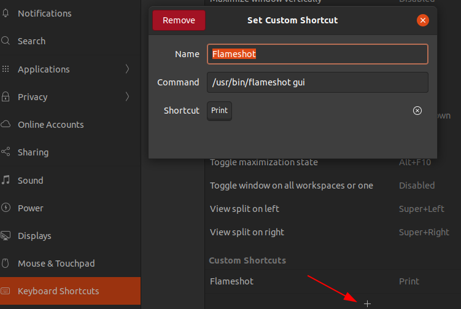
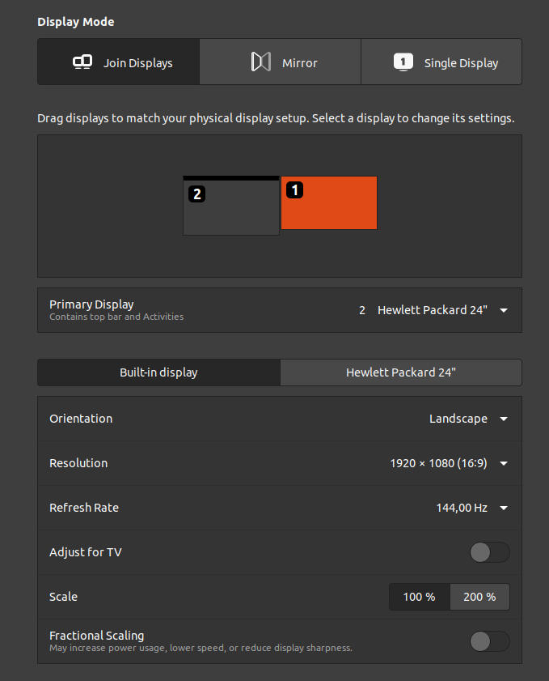
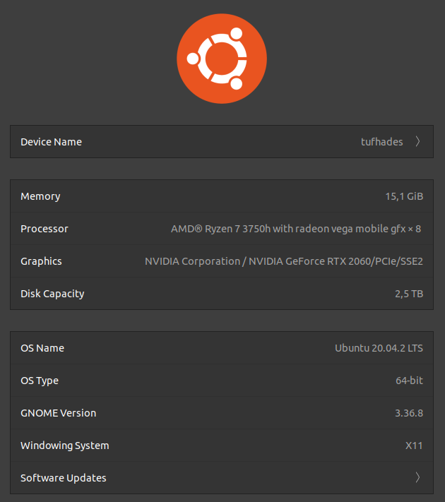
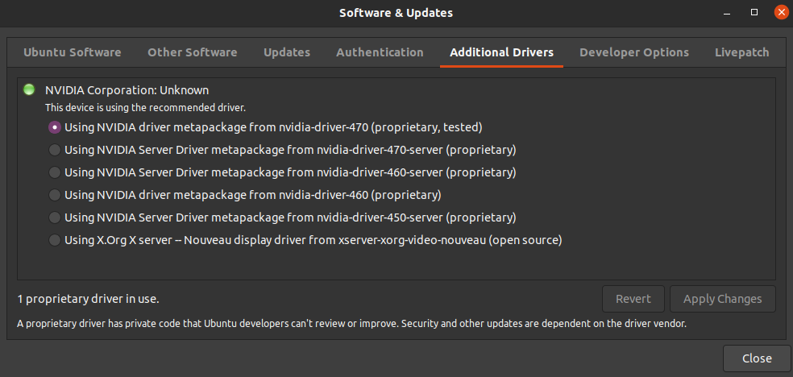

# Linux, Ubuntu 20.04 LTS, and related tidbits

## Report current kernel version

`uname -r` resulting in e.g. `5.8.0-63-generic`

## Edit the grub bootloader to skip fs checks every boot

- editing grub boot loader with `sudo nano /etc/default/grub` and changing:

    ```[bash]
    GRUB_CMDLINE_LINUX_DEFAULT="fsck.mode=skip quiet splash"
    ```

- and then running `sudo update-grub`

## Automount of NAS shares on Ubuntu

Option 1: using a-priori file manager access [as explained in GIO-mount.](https://wiki.ubuntuusers.de/gio_mount)  

- alternatively, manual anonymous mount  
  `gio mount -a smb://SERVER/SHARE`

- manual unmount  
  `gio mount -u smb://SERVER/SHARE`

- location of samba share after mount:  
  `/run/user/1000/gvfs/smb-share\:server\=SERVER\,share\=SHARE/`

&rightarrow; not happy with the options and lack of backward-compatibility

Option 2: running *old-school* mount scripts from my `~/bin` for connecting when required:
[source](https://baihuqian.github.io/2019-10-20-how-to-mount-wd-mycloud-on-ubuntu-18-04)  
My script tests for the availability of the NAS server on the local network and aborts in case
of being on the road with my laptop (no VPN connection back home, so far).
This can be further refined using variables and loops in case of many shares needing connecting.

``` {bash}
#!/bin/bash
if ping -c 1 exampleserver &> /dev/null
then
  if [ ! -d /run/user/1000/gvfs/smb-share\:server\=exampleserver\,share\=exampleshare ]
  then
    echo "... mounting SMB-share exampleshare on exampleserver"
    gio mount -a smb://exampleserver/exampleshare
  else
    echo "... mount already exists - do nothing"
  fi
  if [ ! -d ~/exampleshare ]
  then
    echo "... linking SMB-share to ~/exampleshare"
    ln -s /run/user/1000/gvfs/smb-share\:server\=exampleserver\,share\=exampleshare ~/exampleshare
  else
    echo "... link already exists - do nothing"
  fi
else
  echo "... host exampleserver not found - do nothing"
fi
```

Option 3: using the *CIFS*-package which lets me access shares protected by authentication,
which I didn't get to work with the above methods.  
[source](https://wiki.ubuntuusers.de/mount.cifs/)

- install the package  
  `sudo apt install -y cifs-utils`

- create a credentials file in user home and create mount point  
  `touch .smbcredentials && mkdir examplemountpoint`  
  the file should contain the following login data adjusted to your requirements:

  ``` {bash}
  username=smbexampleuser
  password=smbexamplepassword
  domain=WORKGROUP
  ```

- add an entry to `/etc/fstab`:

  ``` {bash}
  #SMB mount for mycloud share
  //exampleserver/exampleshare /home/exampleuser/examplemountpoint cifs rw,_netdev,noauto,user,credentials=/home/exampleuser/.smbcredentials  0  0
  ```

  which allows a user/owner of the mountpoint to mount and unmount the share read/write using:  
  `mount ~/examplemountpoint` and `umount ~/examplemountpoint`

### Running session scripts

[source](https://unix.stackexchange.com/questions/172179/gnome-shell-running-shell-script-after-session-starts)  
running a script once after Gnome starts up, e.g. for mounting SMB-Shares.  
enter the `gnome-session-properties` configuration tool and add a script

---

## Coding / Software development / Data Analysis Tools

### setting up Git

- check status: `git config --list --show-origin`  
- add user name: `git config --global user.name "yourusername"`  
- add email: `git config --global user.email "email@youremail.com"`  
&rightarrow; settings will be added to ~/.gitconfig file

---

## Setting up SSH with keys

This is fairly old knowledge from the time when did have to do these things manually.

1. adding hosts  
`sudo nano /etc/hosts`

2. generating keys on client [source](https://www.ssh.com/academy/ssh/keygen#choosing-an-algorithm-and-key-size)  
`ssh-keygen -f ~/.ssh/ssh-key-ecdsa -t ecdsa -b 521`  
&rightarrow; supply secret key  
&leftarrow; public and private key generated

3. deploying public key on server  
`ssh-copy-id -i .ssh/ssh-key-ecdsa.pub USER@GUEST`  
&leftarrow; enter password for host  
&rightarrow; public key registered on host

4. verifying key was deployed on server  
`ssh user@server`  
&leftarrow; ubuntu asks for secret key - once

5. secure copy a folder to destination  
`scp -r $FOLDERNAME $SERVERUSER@$SERVERNAME:~`

---

## Further software bits and pieces

### Installing mesa tools for stuff like `glx-info`, `glx-gears`

`sudo apt-get install mesa-utils`

---

### Installing NodeJS from official repository

Ubuntu's NodeJS "out-of-the-box" is not recommended in some scenarios so this is the official repo to link to.

``` {bash}
sudo apt -y install curl dirmngr apt-transport-https lsb-release ca-certificates
curl -sL https://deb.nodesource.com/setup_14.x | sudo -E bash -
sudo apt -y install nodejs && node -v
```

Testing installation by getting a React app up and running:

``` {bash}
npx create-react-app my-app
cd my-app && npm start
```

The app should now be accessible via [http://localhost:3000](http://localhost:3000) or in case of server hosting
via the network - then however, make sure that the firewall allows such traffic.

``` {bash}
sudo ufw status
```

Opening a port:

``` {bash}
sudo ufw allow 3000/tcp
```

---

### Installing Imagemagick for image manipulation

`sudo apt-get install imagemagick`  
and testing function `convert logo: logo.gif`  
best practices for [web images](https://support.squarespace.com/hc/en-us/articles/206542517-Formatting-your-images-for-display-on-the-web) and [manual](https://legacy.imagemagick.org/Usage/resize/)

---

### Removing void packages as completely as possible by example

This can save save significant amounts of storage, e.g. when packaging a docker image.
I can also help with a botched installation.

``` {bash}
sudo apt-get remove --purge libreoffice*
sudo apt-get clean
sudo apt-get autoremove
```

---

### Replacing Snap software store with Gnome software store on a clean Ubuntu Focal Fossa 20.04

The standard software store has recently been changed to **Snap** which does not provide
all the desired tools.  
`sudo apt-get --purge --reinstall install gnome-software`

---

### Putting the Gnome start button to opposite side of task bar

Task bar sits on the left border by default but can be moved to any edge in **Settings**,
however the start button needs to be flipped via command line:  
`gsettings set org.gnome.shell.extensions.dash-to-dock show-apps-at-top true`

---

### Installing Flameshot screengrabber

My experience (2021-09-19) was that the packages on the *Snap Store* did not work out of the box.
I uninstalled those and added the standard packages.

``` {bash}
markus@myubuntu:~$ sudo apt install flameshot
```

It will be necessary to manually configure the screengrab key <kbd>Print</kbd> going through
*GNOME Start* &rightarrow; *Settings* &rightarrow; *Keyboard Shortcuts* and replacing the default for
the key with the command `/usr/bin/flameshot gui`



---

## Setting up battery charge limit on Ubuntu

[source](https://www.linuxuprising.com/2021/02/how-to-limit-battery-charging-set.html)

1. verify that `ls /sys/class/power_supply`  
    returns `AC0  BAT0`  
    and `ls /sys/class/power_supply/BAT*/charge_control_end_threshold`  
    returns an existing path - otherwise function does not exist

2. generate new file: `sudo nano /etc/systemd/system/battery-charge-threshold.service`

    ``` {bash}
    [Unit]
    Description=Set the battery charge threshold
    After=multi-user.target
    StartLimitBurst=0

    [Service]
    Type=oneshot
    Restart=on-failure
    ExecStart=/bin/bash -c 'echo CHARGE_STOP_THRESHOLD > /sys/class/power_supply/BATTERY_NAME/charge_control_end_threshold'

    [Install]
    WantedBy=multi-user.target
    ```

    with `CHARGE_STOP_THRESHOLD` in [60,80,100] and `BATTERY_NAME = BAT0`

3. start and permanently enable service  
    `sudo systemctl enable battery-charge-threshold.service`  
    and  
    `sudo systemctl start battery-charge-threshold.service`

4. check status of charging service: `cat /sys/class/power_supply/BATTERY_NAME/status`  
    with `BATTERY_NAME = BAT0`

---

## enable multiple displays on ASUS TUF Gaming FX505DV-HN311T

[source 1](https://www.linuxbabe.com/desktop-linux/switch-intel-nvidia-graphics-card-ubuntu),  
[source 2](https://www.reddit.com/r/Ubuntu/comments/laf04n/working_asus_tuf_a15_with_ubuntu_2004_rtx_2060)

System hosts two graphics cards:  

- Nvidia RTX 2060
- AMD/ATI Radeon RX Vega 10  

HDMI port apparently hard-wired to Nvidia card (other option would be to use the USB-C port)

1. check hardware specs: `lspci -k | grep -A 2 -i "VGA"`
2. check more hardware specs: `xrandr`
3. check more hardware specs: `sudo lshw -C display`
4. open up the app **Software & Updates**. Click the **Additional Drivers** tab (see, screen shot).
  You can see which driver is used for Nvidia card (Nouveau by default) and a list of additional
  proprietary drivers. Select the most recent tested proprietary driver, e.g. "nvidia-driver-470"
  and **Apply Changes**.  
  Ubuntu will install the drivers and the newest kernel (which had several issues of hardware features missing in my case). However selecting the old kernel in the **grub advanced boot loader** will still provide the driver modules. In my case the old/current/working kernel is `5.8.0-63-generic` and the updated/broken kernel was `5.11.0-25-generic`
5. switching between card settings:
   - select AMD card: `sudo prime-select intel`
   - select Nvidia card: `sudo prime-select nvidia`
   - display current setting: `prime-select query`

  or using the **Nvidia App** and selecting the Prime Profile required  
6. remove new kernel that did not work properly:  
    `sudo apt remove linux-image-5.11.0-25-generic linux-image-unsigned-5.11.0-25-generic --verbose-versions`  
  Note: the Nvidia modules under `/lib/modules/5.11.0-25-generic/kernel` are still required

Screenshots:  
  
  

