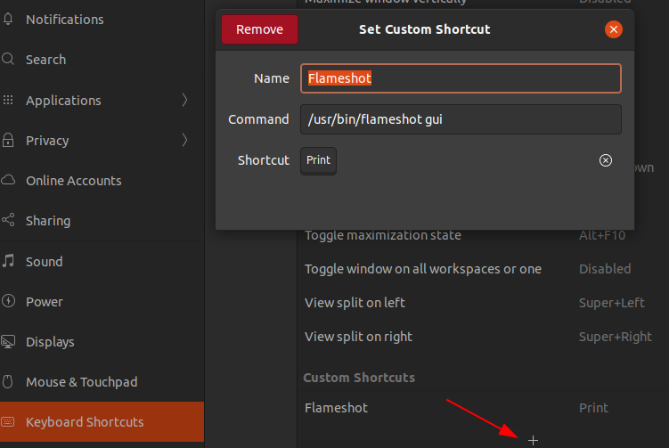
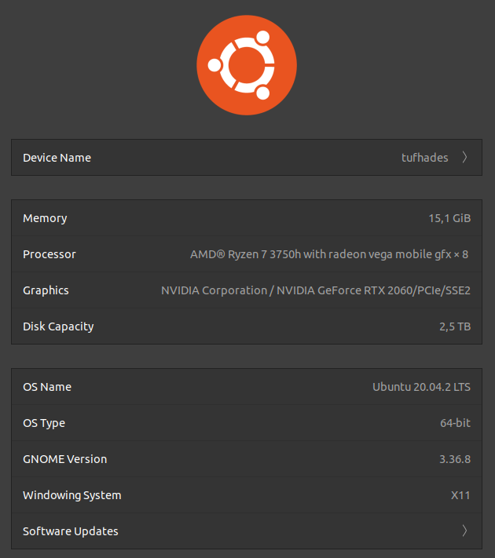

# Ubuntu tips and tricks

## Removing void packages as completely as possible by example

This can save save significant amounts of storage, e.g. when packaging a docker image.
I can also help with a botched installation.

``` {bash}
sudo apt-get remove --purge libreoffice*
sudo apt-get clean
sudo apt-get autoremove
```

---

## Replacing Snap software store with Gnome software store on a clean Ubuntu Focal Fossa 20.04

The standard software store has recently been changed to **Snap** which does not provide
all the desired tools.  
`sudo apt-get --purge --reinstall install gnome-software`

---

## Putting the Gnome start button to opposite side of task bar

Task bar sits on the left border by default but can be moved to any edge in **Settings**,
however the start button needs to be flipped via command line:  
`gsettings set org.gnome.shell.extensions.dash-to-dock show-apps-at-top true`

---

## Installing Flameshot screen grabber

My experience (2021-09-19) was that the packages on the *Snap Store* did not work out of the box.
I uninstalled those and added the standard packages.

```bash
sudo apt install flameshot
```

It will be necessary to manually configure the screen grab key <kbd>Print</kbd> going through
*GNOME Start* &rightarrow; *Settings* &rightarrow; *Keyboard Shortcuts* and replacing the default for
the key with the command `/usr/bin/flameshot gui`



---

## Resizing hard disk partitions

Use case: when a virtual machine's guest runs out of space

1. extend the associated volume on the host system,
2. from a running Ubuntu guest system, get an impression of the current state of the partitioning:  
`sudo parted /dev/sda 'unit s print' free`
3. extend the partition table using:  
`sudo cparted`  
using the steps resizing and writing the table.
4. extend the actual file system:  
`sudo resize2fs /dev/sda3 10353915`  
the number is provided in blocks (4096B) and based on the sector length (512B).

Note: this might require additional steps for more complicated partitioning and is generally a bad idea for active systems.

---

## Fix busted networking

Use case: a virtual machine has collapsed and its network is no longer reachable or able to ping outside

Try one of the following:

- on the guest settings of your virtual machine, remove the networking adapter and reinsert it,
- `sudo nmcli networking on`,
- `sudo apt-get --reinstall install docker-ce docker-ce-cli containerd.io`,

---

### Disconnected WiFi (Jammy 22.04 LTS)

Solution is to reduce the power-saving level by editing `/etc/NetworkManager/conf.d/default-wifi-powersave-on.conf`:

```bash
[connection]
wifi.powersave = 2
```

Another issue might be the 2.4/5.0 GHz band-switching behavior initiated by an optimization attempt of the wifi module.
This behavior can be limited by restricting the BSSID (MAC) address in the client's wifi-connection settings.
Alternatively, one can control the connection further by declaring individual SSID AP names for each frequency band.
There will be info in the connection log of the router and by investigating the kernel log  
`sudo dmesg`  
.

---

## Setting up battery charge limit on Ubuntu

[source](https://www.linuxuprising.com/2021/02/how-to-limit-battery-charging-set.html)

1. verify that `ls /sys/class/power_supply`  
    returns `AC0  BAT0`  
    and `ls /sys/class/power_supply/BAT*/charge_control_end_threshold`  
    returns an existing path - otherwise function does not exist

2. generate new file: `sudo nano /etc/systemd/system/battery-charge-threshold.service`

    ``` {bash}
    [Unit]
    Description=Set the battery charge threshold
    After=multi-user.target
    StartLimitBurst=0

    [Service]
    Type=oneshot
    Restart=on-failure
    ExecStart=/bin/bash -c 'echo CHARGE_STOP_THRESHOLD > /sys/class/power_supply/BATTERY_NAME/charge_control_end_threshold'

    [Install]
    WantedBy=multi-user.target
    ```

    with `CHARGE_STOP_THRESHOLD` in [60,80,100] and `BATTERY_NAME = BAT0`

3. start and permanently enable service  
    `sudo systemctl enable battery-charge-threshold.service`  
    and  
    `sudo systemctl start battery-charge-threshold.service`

4. check status of charging service: `cat /sys/class/power_supply/BATTERY_NAME/status`  
    with `BATTERY_NAME = BAT0`

---

## enable multiple displays on ASUS TUF Gaming FX505DV-HN311T

[source 1](https://www.linuxbabe.com/desktop-linux/switch-intel-nvidia-graphics-card-ubuntu),  
[source 2](https://www.reddit.com/r/Ubuntu/comments/laf04n/working_asus_tuf_a15_with_ubuntu_2004_rtx_2060)

System hosts two graphics cards:  

- Nvidia RTX 2060
- AMD/ATI Radeon RX Vega 10  

HDMI port apparently hard-wired to Nvidia card (other option would be to use the USB-C port)

1. check hardware specs: `lspci -k | grep -A 2 -i "VGA"`
2. check more hardware specs: `xrandr`
3. check more hardware specs: `sudo lshw -C display`
4. open up the app **Software & Updates**. Click the **Additional Drivers** tab (see, screen shot).
  You can see which driver is used for Nvidia card (Nouveau by default) and a list of additional
  proprietary drivers. Select the most recent tested proprietary driver, e.g. "nvidia-driver-470"
  and **Apply Changes**.  
  Ubuntu will install the drivers and the newest kernel (which had several issues of hardware features missing in my case). However selecting the old kernel in the **grub advanced boot loader** will still provide the driver modules. In my case the old/current/working kernel is `5.8.0-63-generic` and the updated/broken kernel was `5.11.0-25-generic`
5. switching between card settings:
   - select AMD card: `sudo prime-select intel` (Note: this should be a good default for office application)
   - select Nvidia card: `sudo prime-select nvidia`
   - display current setting: `prime-select query`

  or using the **Nvidia App** and selecting the Prime Profile required  
6. remove new kernel that did not work properly:  
    `sudo apt remove linux-image-5.11.0-25-generic linux-image-unsigned-5.11.0-25-generic --verbose-versions`  
  Note: the Nvidia modules under `/lib/modules/5.11.0-25-generic/kernel` are still required
7. *Update (2023-06-09)*: had some issues with Nvidia driver v.530 showing lag on external display via HDMI.  
  Rolled it back to v.515 and enabled wayland () vs. X11; set the kernel to `5.19.17-051917-generic`.  
  Check for disabled `#WaylandEnable=false` in `/etc/gdm3/custom.conf` to make sure that it is enabled.

Screenshots:  
  
  


---

### Install GRUB customizer

[source](https://wiki.ubuntuusers.de/GRUB_Customizer/)

- Register sources: `sudo add-apt-repository ppa:danielrichter2007/grub-customizer`
- Install: `sudo apt-get install grub-customizer`

---

## Manual and selective kernel update

1. download script, enable and move to proper location:

    ```bash
    sudo wget https://raw.githubusercontent.com/pimlie/ubuntu-mainline-kernel.sh/master/ubuntu-mainline-kernel.sh
    sudo chmod +x ubuntu-mainline-kernel.sh
    sudo mv ubuntu-mainline-kernel.sh /usr/local/bin
    ```

2. Obtaining info on latest minor and newest major kernels available: `ubuntu-mainline-kernel.sh -c`
3. Listing index of available kernels: `ubuntu-mainline-kernel.sh -r`
4. Installing particular kernel, e.g., `sudo ubuntu-mainline-kernel.sh -i v5.19.17`
5. To finalize restart Ubuntu and select kernel in advanced Grub boot options

---

## Various other pieces of software

### Installing mesa tools for stuff like `glx-info`, `glx-gears`

`sudo apt-get install mesa-utils`

---

### Installing NodeJS from official repository

Ubuntu's NodeJS "out-of-the-box" is not recommended in some scenarios so this is the official repo to link to.

``` {bash}
sudo apt -y install curl dirmngr apt-transport-https lsb-release ca-certificates
curl -sL https://deb.nodesource.com/setup_14.x | sudo -E bash -
sudo apt -y install nodejs && node -v
```

Testing installation by getting a React app up and running:

``` {bash}
npx create-react-app my-app
cd my-app && npm start
```

The app should now be accessible via [http://localhost:3000](http://localhost:3000) or in case of server hosting
via the network - then however, make sure that the firewall allows such traffic.

``` {bash}
sudo ufw status
```

Opening a port:

``` {bash}
sudo ufw allow 3000/tcp
```

---

### Installing Imagemagick for image manipulation

`sudo apt-get install imagemagick`  
and testing function `convert logo: logo.gif`  
best practices for [web images](https://support.squarespace.com/hc/en-us/articles/206542517-Formatting-your-images-for-display-on-the-web) and [manual](https://legacy.imagemagick.org/Usage/resize/)

---

## New installation of Ubuntu Jammy Jellyfish 22.04 LTS

## Packages

### Firefox

`sudo add-apt-repository ppa:mozillateam/ppa`
`sudo apt update`
`sudo apt install firefox-esr`

#### Basic configuration

1. Sign-in to sync via burger menu's `Settings`
2. In `Settings`, set `Website appearance` to `Dark`
3. In `Settings`, navigate to `Extensions & Themes` in `Themes` enable `Dark` theme

#### Enable smaller bookmarks

a) Enter `about:config` and set `browser.compactmode.show=true`
b) Right-click menu bar and select `Customize Toolbar`
c) In the bottom menu bar set `Density` option to `Compact (not supported)`

### Snap Store

1. List versions via `snap list --all`
2. Restrict number of historic versions to keep in store `sudo snap set system refresh.retain=2`
3. Add shell script to `~/bin` and make executable using `chmod +x clean_snap.sh`

    ```bash
    #!/bin/bash
    #Removes old revisions of snaps
    #CLOSE ALL SNAPS BEFORE RUNNING THIS
    set -eu
    LANG=en_US.UTF-8 snap list --all | awk '/disabled/{print $1, $3}' |
        while read snapname revision; do
            snap remove "$snapname" --revision="$revision"
        done
    ```

4. Invoke using `sudo ./clean_snap.sh`

#### Snap Store update hanging

[source](https://askubuntu.com/questions/1412575/pending-update-of-snap-store)

- Quit the store background process `snap-store --quit`
- and run refresh `sudo snap refresh`

#### Snap Store replacement with Gnome Software Store

[source](https://ubuntuhandbook.org/index.php/2022/04/gnome-software-ubuntu-2204/)

- Remove Snap Store: `sudo snap remove --purge snap-store`
- Install Flatpak `sudo apt install flatpak`
- Register repo path `flatpak remote-add --if-not-exists flathub https://flathub.org/repo/flathub.flatpakrepo`
- Install store including flatpak support `sudo apt install --install-suggests gnome-software`
- Potentially, make sure that the plugin was installed: `killall gnome-software`
- `rm -rf ~/.cache/gnome-software`
- `sudo apt-get --reinstall install -y gnome-software-plugin-flatpak`
- `flatpak update`

### Curl install

`sudo apt  install curl`

### Spotify install

[source](https://www.spotify.com/de/download/linux/)

- Run `curl -sS https://download.spotify.com/debian/pubkey_7A3A762FAFD4A51F.gpg | sudo gpg --dearmor --yes -o /etc/apt/trusted.gpg.d/spotify.gpg`
- And then `echo "deb http://repository.spotify.com stable non-free" | sudo tee /etc/apt/sources.list.d/spotify.list`
- Finally, `sudo apt-get update && sudo apt-get install spotify-client`

### Git

1. Install using `sudo apt-get install git-all`
2. Check version `git version`

#### Within a repo

- check status: `git config --list --show-origin`  
- add user name: `git config --global user.name "yourusername"`  
- add email: `git config --global user.email "email@youremail.com"`  
&rightarrow; settings will be added to ~/.gitconfig file

### Install VS Code

[source](https://code.visualstudio.com/docs/setup/linux)

1. Prerequisites

    ```bash
    sudo apt-get install wget gpg
    wget -qO- https://packages.microsoft.com/keys/microsoft.asc | gpg --dearmor > packages.microsoft.gpg
    sudo install -D -o root -g root -m 644 packages.microsoft.gpg /etc/apt/keyrings/packages.microsoft.gpg
    sudo sh -c 'echo "deb [arch=amd64,arm64,armhf signed-by=/etc/apt/keyrings/packages.microsoft.gpg] https://packages.microsoft.com/repos/code stable main" > /etc/apt/sources.list.d/vscode.list'
    rm -f packages.microsoft.gpg
    ```

2. Install

    ```bash
    sudo apt install apt-transport-https
    sudo apt update
    sudo apt install code
    ```

3. Configuration by starting VS Code and signing in to the sync option using Github account  
&rightarrow; extensions and settings will be added from my configuration.
